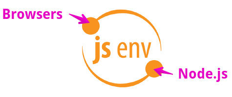

# @jsenv/core [](https://www.npmjs.com/package/@jsenv/core)

Jsenv was created to provide a tool that can be used both for the web and Node.js.
It has naturally evolved to cover the core needs of a JavaScript project: developement, testing and building for production.

- :ok_hand: Seamless integration with standard HTML, CSS and JS.
- :sparkles: Same tooling for dev, tests and build.
- :exploding_head: Can execute tests on Chrome, Firefox, Safari and Node.js.

# Documentation

https://github.com/jsenv/jsenv-core/wiki

# Installation

```console
npm install --save-dev @jsenv/core
```

_@jsenv/core_ is tested on Mac, Windows, Linux with Node.js 18.
Other operating systems and Node.js versions are not tested.

# Name

The name "jsenv" stands for JavaScript environments.<br />
"jsenv" without capital letter because "JSEnv" would be too painful to type.

# Logo

The logo is composed by the name at the center and two circles orbiting around it.
One of the circle is web browsers, the other is Node.js.
It represents the two JavaScript runtimes supported by jsenv.



# See also

| Link                                                                                              | Description                                             |
| ------------------------------------------------------------------------------------------------- | ------------------------------------------------------- |
| [@jsenv/assert](./packages/assert)                                                                | NPM package to write assertions                         |
| [I am too lazy for a test framework](https://dev.to/dmail/i-am-too-lazy-for-a-test-framework-92f) | Article presenting a straightforward testing experience |
