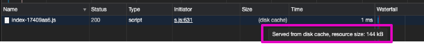

# Table of contents

- [Presentation](#Presentation)
- [Code example](#Code-example)
- [Concatenation](#Concatenation)
- [Minification](#Minification)
- [Long term caching](#Long-term-caching)
- [JavaScript modules](#JavaScript-modules)
  - [SystemJS format](#SystemJS-format)
    - [import maps](#import-maps)
    - [top level await](#top-level-await)
- [Bundle for Node.js](#Bundle-for-nodejs)
- [API](./bundle-api.md)

# Presentation

A bundle consist into taking one or many input files to generate one or many output files. It creates a step between dev and production where you can perform specific optimizations:

- File concatenation to save http request
- Minify file content to reduce file size
- Hash url to enable long term caching
- Transform file content to support more execution environments (old browsers for instance)

Bundling for the web means generating files that will be executed by a web browser (Chrome, Firefox, and so on). To do that provide your main html file to a function called `generateBundle`. It will collect all the files used directly or indirectly by the html file. Once all the files are known they are eventually minified, concatened and file urls are replaced with a unique url identifier to enable long term caching.

# Code example

In practice you pass a `main.html` and `generateBundle` writes a file in `dist/main.html`.

```js
import { generateBundle } from "@jsenv/core"

await generateBundle({
  projectDirectoryUrl: new URL("./", import.meta.url),
  bundleDirectoryRelativeUrl: "dist",
  enryPointMap: {
    "./index.html": "main.html",
  },
  minify: false,
})
```

> To keep example concise, the following files content is not shown: `favicon.ico`, `project.importmap`, `main.css` and `index.js`.

<details>
  <summary>index.html</summary>

```html
<!DOCTYPE html>
<html>
  <head>
    <title>Title</title>
    <meta charset="utf-8" />
    <link rel="icon" href="./favicon.ico" />
    <script type="importmap" src="./project.importmap"></script>
    <link rel="stylesheet" type="text/css" href="./main.css" />
  </head>

  <body>
    <script type="module" src="./main.js"></script>
  </body>
</html>
```

</details>

<details>
  <summary>dist/main.html</summary>

```html
<!DOCTYPE html>
<html>
  <head>
    <title>Title</title>
    <meta charset="utf-8" />
    <link rel="icon" href="assets/favicon-5340s4789a.ico" />
    <script type="importmap" src="import-map-b237a334.importmap"></script>
    <link rel="stylesheet" type="text/css" href="assets/main-3b329ff0.css" />
  </head>

  <body>
    <script type="module" src="./main-f7379e10.js"></script>
  </body>
</html>
```

</details>

# Concatenation

By default jsenv concatenates will concatenates js files as much as possible. There is legimitimates reasons to disable this behaviour. Merging `n` files into chunks poses two issues:

- On big project it becomes very hard to know what ends up where.
  Tools like [webpack bundle analyzer](https://github.com/webpack-contrib/webpack-bundle-analyzer) exists to mitigate this but it's still hard to grasp what is going on.
- When a file part of a chunk is modified the entire chunk must be recreated. A returning user have to redownload/parse/execute the entire chunk even if you modified only one line in one file.

Disabling concatenation fixes the two issue it creates (of course) but also means browser will have to create an http request per file. Thanks to http2, one connection can be reused to server `n` file meaning concatenation becomes less effective.

> It's still faster for a web browser to donwload/parse/execute one big file than doing the same for 50 tiny files.

To me you should consider the following before disabling concatenation:

- Is your production server compatible with http2 ?
- Does your website provide a user friendly loading experience (A loading screen + a progress bar for instance) ?
- Do you have a lot of returning users ? Which one do you want to favor between new/returning users.

To disable concatenation of js files use `jsConcatenation` parameter.

```js
import { generateBundle } from "@jsenv/core"

await generateBundle({
  projectDirectoryUrl: new URL("./", import.meta.url),
  jsConcatenation: false,
})
```

# Minification

Minification is enabled by default when `process.env.NODE_ENV` is `"production"` and disabled otherwise. When true js, css, html, importmap, json, svg are minified.

# Long term caching

Long term caching consists into configuring a web server to send a `cache-control` header when serving your files. By doing so the browser will cache the file for the duration configured by the server and won't even ask the server if the file changed for subsequent requests.

The screenshot belows shows how a 144kB file takes 1ms for the browser to fetch in that scenario.



> An article to explain long term caching: https://jakearchibald.com/2016/caching-best-practices/#pattern-1-immutable-content--long-max-age

This is a massive boost in performance but can be tricky to setup because you need to know how and when to invalidate browser cache. Jsenv enable long term caching by default by computing a unique url for each file and update any reference to that url accordingly.

As you can see in the previous section

```html
<link rel="icon" href="./favicon.ico" />
```

Became

```html
<link rel="icon" href="assets/favicon-5340s4789a.ico" />
```

Jsenv does this for every url found in html, js, css and svg files. It uses parse5 to parse html, Babel to parse JavaScript and PostCSS to parse css. For instance, if `main.css` content is the following:

```css
body {
  background: url("./favicon.ico");
}
```

`dist/assets/main-3b329ff0.css` content is the following:

```css
body {
  background: url("favicon-5340s4789a.ico");
}
```

If you don't want to change urls to enable long term caching use `longTermCaching` parameter.

```js
import { generateBundle } from "@jsenv/core"

await generateBundle({
  projectDirectoryUrl: new URL("./", import.meta.url),
  longTermCaching: false,
})
```

— link to Babel on GitHub: https://github.com/babel/babel<br />
— link to PostCSS on GitHub: https://github.com/postcss/postcss<br />
— link to parse5 on GitHub: https://github.com/inikulin/parse5

# JavaScript modules

JavaScript modules, also called ES modules, refers to the browser support for the `import` and `export` keywords.

> For a more detailed explanation about JavaScript modules, see https://developer.mozilla.org/en-US/docs/Web/JavaScript/Guide/Modules

By default jsenv generate bundle assuming the browser will support JavaScript modules. But for reasons detailed below you might want to output bundle using the [SystemJS format](#SystemJS-format)

## SystemJS format

SystemJS format can be used if you want to use [import maps](#import-maps) or [top level await](#top-level-await) in your codebase.

To use SystemJS format, use `format` parameter

```js
import { generateBundle } from "@jsenv/core"

await generateBundle({
  projectDirectoryUrl: new URL("./", import.meta.url),
  bundleDirectoryRelativeUrl: "dist",
  enryPointMap: {
    "./index.html": "main.html",
  },
  minify: false,
  format: "systemjs",
})
```

<details>
  <summary>dist/main.html</summary>

```html
<!DOCTYPE html>
<html>
  <head>
    <title>Title</title>
    <meta charset="utf-8" />
    <link rel="icon" href="assets/favicon-5340s4789a.ico" />
    <script src="assets/s.min-550cb99a.js"></script>
    <script type="systemjs-importmap" src="import-map-b237a334.importmap"></script>
    <link rel="stylesheet" type="text/css" href="assets/main-3b329ff0.css" />
  </head>

  <body>
    <script type="systemjs-module" src="./main-f7379e10.js"></script>
  </body>
</html>
```

</details>

When using this format the html generated is a bit different:

- `<script type="module">` are transformed into `<script type="systemjs-module">`
  > This also means bundle becomes compatilbe with browser that does not support `<script type="module"></script>`.
- `<script type="importmap">` are transformed into `<script type="systemjs-importmap">`

- `<script src="assets/s.min-550cb99a.js"></script>` was injected into `<head>`

  > To is to provide `window.System` needed by SystemJS.

  > If you have no `<script type="module"></script>` in the html file, this script is not needed so it's no injected in `<head>`

— Link to SystemJS on GitHub: https://github.com/systemjs

### import maps

Browser does not yet support import maps while they drastically improve reuse of files configured with [Long term caching](#Long-term-caching). Without import maps `1` modification invalidates `n` files in cache. With import maps `1` modification invalidates `1` file in cache. They also enable a standard way to remap imports that improves developper experience.

<details>
  <summary>See details on how import maps improves cache reuse</summary>

Without import maps changing a file content update its unique url with hash and all files referencing that url (directrly or indirectly) must be updated. To illustrate, let's say you have three js files:
`main.js` importing `dependency.js` which is importing `foo.js`. You have a dependency tree between files that looks like this:

```console
main.js
  └── dependency.js
          └────── foo.js
```

You can generate a first bundle, dependency tree becomes:

```console
main-x3rdf.js
  └── dependency-vjdt3.js
          └────── foo-rtiu76.js
```

At this point browser puts the 3 urls in cache.

Later, you update `foo.js`:

1. jsenv computes `foo.js` url -> `foo-newhash.js`.
2. jsenv updates `dependency.js` so that `import "./foo.js"` becomes `import "./foo-newhash.js"`
3. jsenv also needs to update `main.js` because `dependency.js` have changed.

In the end 1 file is modified but 3 urls needs to be updated.

Import maps allows to tell browser exactly which files have changed and reuse the ones that are not modified.

</details>

<details>
  <summary>See details on how importmaps imrpove developer experience</summary>
  The ability to remap import is important to simplify the developper experience when reading and writing imports.

```js
import "../../file.js"
// vs
import "src/feature/file.js"
```

The following html will become supported by browsers natively:

```html
<!DOCTYPE html>
<html>
  <head>
    <title>Title</title>
    <meta charset="utf-8" />
    <script type="importmap">
      {
        "imports": {
          "src/": "./src/"
        }
      }
    </script>
  </head>

  <body>
    <script type="module">
      import "src/feature/file.js"
    </script>
  </body>
</html>
```

</details>

If you want any of the benefits of import maps you should use SystemJS format until browser support import maps natively.

— Link to import maps specifications on GitHub: https://github.com/WICG/import-maps

### top level await

Top level await is the ability to write `await` at the top level of your program.

```js
const a = await Promise.resolve(42)

export default a
```

Top level await, depites being useful, is not yet supported by browsers are reported in chrome platform status: https://www.chromestatus.com/feature/5767881411264512. By using SystemJS format it becomes possible to use it right now.

# Bundle for Node.js

TODO
