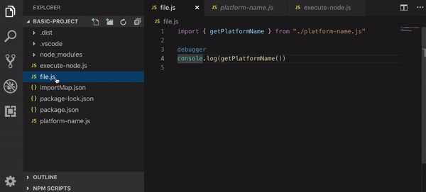

# Table of contents

- [Execute presentation](#Execute-presentation)
- [File execution recorded](#File-execution-recorded)
- [Execute concrete example](#Execute-concrete-example)
  - [1 - Setup basic project](#1---Setup-basic-project)
  - [2 - Executing file on chromium](#2---Executing-file-on-chromium)
  - [3 - Executing file on Node.js](#3---Executing-file-on-Node.js)
  - [4 - Debug file inside vscode](#4---Debug-file-inside-vscode)
    - [Debugger inconsistency](#Debugger-inconsistency)
- [Execute api](#Execute-api)

# File execution recorded

The following gif shows a file debugging session inside vscode. The file is being executed on Node.js by jsenv execute function.
Also note that this file was executed on node 12.0 where import and export keywords were not available.


— gif generated from [./vscode-debug-node.mp4](./vscode-debug-node.mp4)

# Execute concrete example

This part helps you to setup a project on your machine to create scripts capable to execute any file inside chromium or node.js.<br />
You can also reuse the project file structure to understand how to integrate jsenv to execute your files.

## 1 - Setup basic project

```console
git clone https://github.com/jsenv/jsenv-core.git
```

```console
cd ./jsenv-core/docs/executing/basic-project
```

```console
npm install
```

## 2 - Executing file on chromium

```console
node ./execute-chromium.js index.js
```

`browser` will be logged in your terminal.

## 3 - Executing file on Node.js

```console
node ./execute-node.js index.js
```

`node` will be logged in your terminal.

## 4 - Debug file inside vscode

If you are using vscode you can also debug the file execution within your editor.
This is what is shown in [File execution recorded](#-File-execution-recorded).

To achieve that you need a `.vscode/launch.json` file with the following content.

```json
{
  "version": "0.2.0",
  "configurations": [
    {
      "name": "jsenv-node",
      "type": "node",
      "request": "launch",
      "protocol": "inspector",
      "program": "${workspaceFolder}/script/run-node/run-node.js",
      "args": ["${relativeFile}"],
      "autoAttachChildProcesses": true,
      "sourceMaps": true,
      "smartStep": true,
      "skipFiles": ["node_modules/**", "<node_internals>/**"]
    }
  ]
}
```

If you already have one, just add the configuration without replacing the entire file.
You also have to create the `script/run-node/run-node.js` file.
Jsenv itself use it so you can find it at [script/run-node/run-node.js](../../script/run-node/run-node.js).

### Debugger inconsistency

Sometimes vscode fails to auto attach child process debugging session.<br />
When it happens you must manually attach it.<br />

To do that you can add an other configuration in your `launch.json`.

```json
{
  "name": "jsenv-node-attach-child",
  "type": "node",
  "request": "attach",
  "port": 40000,
  "smartStep": true,
  "sourceMaps": true,
  "skipFiles": ["node_modules/**", "<node_internals>/**/*.js"]
}
```

## Execute api

If you want to know more about `execute`, there is a more detailed documentation on it.<br />
— see [`execute` documentation](./api.md)
