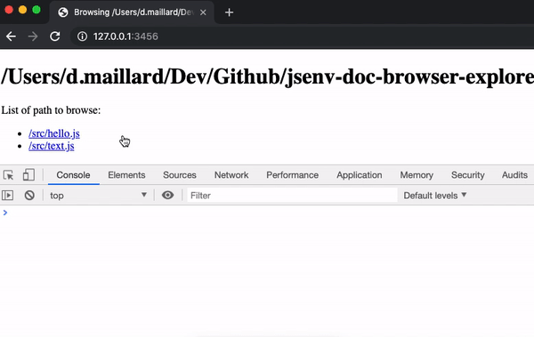
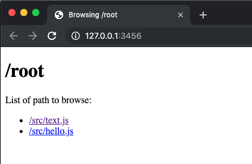
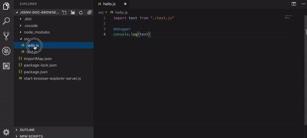

# Exploring server

This feature is provided by `@jsenv/core` which exports a function called `startExploringServer`.<br />

`startExploringServer` starts a server.<br />
The server creates an html page listing your project files.<br />
Each link goes to an url where your JavaScript file will be executed.<br />

Thanks to this, any file or your project can become an entry point. You can use it to debug a file in isolation or even to create a storybook.

Finally, it is fast because transpiled files are cached on your filesystem.<br />

This documentation explains how to use `startExploringServer` inside a project.<br />



## 1. How to use

This part setup a basic project to show how to use exploring server inside it.

### Basic project setup

1. Create a file structure like this one

```
root/
  src/
    text.js
    hello.js
  package.json
```

`root/src/text.js`

```js
export default "Hello world"
```

`root/src/hello.js`

```js
import text from "./text.js"

console.log(text)
```

`root/package.json`

```json
{
  "name": "whatever"
}
```

2. Install `@jsenv/core`

```shell
npm install --save-dev @jsenv/core
```

3. Generate `root/importMap.json`

```shell
npm i --save-dev @jsenv/node-module-import-map
node -e "require('@jsenv/node-module-import-map').generateImportMapForProjectNodeModules({ projectPath: process.cwd() });"
```

### How to use exploring server inside that basic project

1. Create a script that will start exploring server

`root/start-exploring-server.js`

```js
const { startExploringServer } = require("@jsenv/core")

startExploringServer({
  projectPath: __dirname,
  explorableMap: {
    "/src/*.js": true,
  },
  port: 3456,
})
```

2. Run `root/start-exploring-server.js` you just created

```shell
node ./start-exploring-server.js
```

A first main server will start. This one is used by the whole jsenv project.<br />
A second server will start. That's the one we're interested in right now. The url `http://127.0.0.1:3456` is logged in your terminal.<br />

3. Open `http://127.0.0.1:3456` using a browser

Once server is started you can navigate to `http://127.0.0.1:3456` and you will see an html page listing the files you can explore.



4. Explore files

The gif on top of this document illustrates this part.

- If you go to `http://127.0.0.1:3456/src/hello.js` your console will contain a log saying `Hello world`.
  It shows that if your file execution renders something, you can see the effect in your browser.
- If you go to `http://127.0.0.1:3456/src/text.js` nothing special will happen because `/src/text.js` is just a module with an export default.<br />
  It shows that even if your file do not render anything, you still can use this functionnality to debug your file.

## 2. `startExploringServer` options

This part explains the code you have written inside `root/start-exploring-server.js`.

### explorableMap

If you don't pass this option, the default value will be:

```js
{
  "/index.js": true,
  "/src/**/*.js": true,
  "/test/**/*.js": true
}
```

The server index page will list files described as explorable.<br />
Server will not handle request mades to non explorable files.<br />
explorableMap default value means:

- `/index.js` file is explorable
- any file inside `/src/` ending with `.js` is explorable
- any file inside `/test/` ending with `.js` is explorable

This option internally uses path matching provided by `dmail/project-structure`.<br />
— see [project structure on github](https://github.com/dmail/project-structure)

### protocol

> protocol used by the server, you can also pass `"https"`.

If you don't pass this option, the default value will be:

```js
"http"
```

### ip

> ip server will listen to.

If you don't pass this option, the default value will be:

```js
"127.0.0.1"
```

### port

> port server will listen to.

0 means a random available port will be used.

If you don't pass this option, the default value will be:

```js
0
```

### forcePort

> When true, server will try to kill any process eventually using the port it wants to listen.

If you don't pass this option, the default value will be:

```js
false
```

### browserClientRelativePath

> Files inside this folder will be served by browser explorer server.<br /> `index.html` inside it will be used as a template to execute your JavaScript files.

If you use a custom folder with your own `index.html`, be sure it contains the script tag below:

```html
<script src="/.jsenv/browser-script.js"></script>
```

This is because server will serve a dynamic self executing js at `"/.jsenv/browser-script.js"`.

If you don't pass this option, the default value will be:

```js
"/node_modules/@jsenv/core/src/browser-client"
```

### projectPath

— see [generic documentation for projectPath](../shared-options/shared-options.md#projectpath)

### babelPluginMap

— see [generic documentation for babelPluginMap](../shared-options/shared-options.md#babelpluginmap)

### importMapRelativePath

— see [generic documentation for importMapRelativePath](../shared-options/shared-options.md#importmaprelativepath)

### compileIntoRelativePath

— see [generic documentation for compileIntoRelativePath](../shared-options/shared-options.md#compileintorelativepath)

## Use exploring server to debug file within vscode

What if you could debug inside chrome the file currently opened in vscode?<br />

1. Install `debugger for chrome` vscode extension

Link to extension: https://marketplace.visualstudio.com/items?itemName=msjsdiag.debugger-for-chrome

2. Add a launch configuration in `root/.vscode/launch.json`

```json
{
  "version": "0.2.0",
  "configurations": [
    {
      "name": "jsenv-chrome",
      "type": "chrome",
      "request": "launch",
      "url": "http://127.0.0.1:3456/${relativeFile}",
      "runtimeArgs": ["--allow-file-access-from-files", "--disable-web-security"],
      "sourceMaps": true,
      "sourceMapPathOverrides": {
        "/*": "${workspaceFolder}/*"
      },
      "smartStep": true,
      "skipFiles": ["node_modules/**", "<node_internals>/**/*.js"]
    }
  ]
}
```

3. Start exploring server

```shell
node ./start-exploring-server.js
```

4. Start a debugging session using `jsenv chrome`

I made a video of the debugging session inside vscode. The gif below was generated from that video.



# End

You've reached the end of this documentation, congrats for scrolling so far.<br />
Let me suggest you to:

- take a break, reading doc or scrolling can be exhausting :)
- [go back to readme](../../README.md#how-to-use)
- [go to next doc on execution](../execution/execution.md)

If you noticed issue in this documentation, you're very welcome to open [an issue](https://github.com/jsenv/jsenv-core/issues). I would love you even more if you [create a pull request](https://github.com/jsenv/jsenv-core/pulls) to suggest an improvement.
