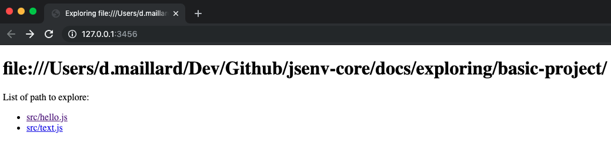

# Table of contents

- [Exploring presentation](#Exploring-presentation)
- [Exploring recorded video](#Exploring-recorded-video)
- [Exploring concrete example](#Exploring-concrete-example)
  - [1 - Setup basic project](#1---Setup-basic-project)
  - [1 - Explore basic project](#2---Explore-basic-project)

# Exploring presentation

Frontend projects often comes with a local server running on your machine.

These type of servers focuses on development. During development files change often and developper want a fast feedback to see effects of thoose changes.

You can use jsenv to start a server serving an html page containing a list of links to your project files. Each link goes to an url where your JavaScript file will be executed. Thanks to this, any file in your project can become an entry point. You can use it to debug a file in isolation, create a storybook and so on.

This tool is called exploring.

# Exploring recorded video

The following video was recorded to show exploring feature in action on a basic project. The developper debugs `hello.js` file inside chrome.


<br />
— gif generated from [./exploring-with-chrome-recording.mp4](./exploring-with-chrome-recording.mp4)

To reproduce the environment in this gif you can follow the next part.

# Exploring concrete example

This part helps you to setup a project on your machine to play with jsenv exploring.<br />
You can also reuse the project file structure to understand how to integrate jsenv to explore your own project files.

## 1 - Setup basic project

```console
git clone https://github.com/jsenv/jsenv-core.git
```

```console
cd ./jsenv-core/docs/exploring/basic-project
```

```console
npm install
```

## 2 - Explore basic project

```console
node ./start-exploring.js
```

A first main server will start. This one is used by the whole jsenv project.<br />
A second server will start. That's the one we're interested in right now. The url `http://127.0.0.1:3456` is logged in your terminal.<br />

Once server is started you can navigate to `http://127.0.0.1:3456` and you will see an html page listing the files you can explore.



- If you go to `http://127.0.0.1:3456/src/hello.js` page displays `Hello world`.
  It shows that if your file execution renders something, you can see the effect in your browser.
- If you go to `http://127.0.0.1:3456/src/text.js` nothing special will happen because `/src/text.js` is just a module with an export default.<br />
  It shows that even if your file do not render anything, you still can use this functionnality to debug your file.

If you want to know more about `exploring`, there is a dedicated page for that.<br />
— see [startExploring api documentation](./api.md)
