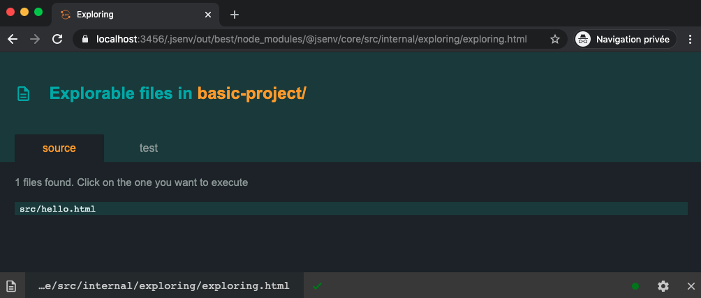
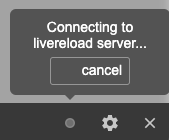
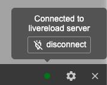
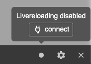
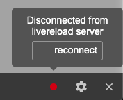

# Table of contents

- [Exploring presentation](#Exploring-presentation)
- [Exploring concrete example](#Exploring-concrete-example)
  - [1 - Setup basic project](#1---Setup-basic-project)
  - [2 - Explore basic project](#2---Explore-basic-project)
- [Exploring integration](#Exploring-integration)
- [startExploring example](#startExploring-example)
- [startExploring parameters](#startExploring-parameters)
  - [explorableConfig](#ExplorableConfig)
  - [livereloading](#livereloading)
  - [watchConfig](#watchConfig)
  - [toolbar](#toolbar)
    - [back button](#back-button)
    - [file input](#file-input)
    - [execution indicator](#execution-icon)
    - [livereload indicator](#livereload-indicator)
    - [settings button](#settings-button)
    - [close button](#close-button)
  - [Server parameters](#Server-parameters)
  - [Shared parameters](#Shared-parameters)
- [startExploring return value](#startExploring-return-value)

# Exploring presentation

Frontend projects often comes with a local server running on your machine.

These type of servers focuses on development. During development files change often and developper want a fast feedback to see effects of thoose changes.

You can use jsenv to start a server serving an html page containing a list of links to your project files. Each link goes to an url where your file will be executed. Thanks to this, any html file in your project can become an entry point. You can use it to debug a file in isolation, create a storybook and so on.

Jsenv call this `exploring`.

# Exploring concrete example

This part helps you to setup a project on your machine to play with jsenv exploring.<br />
You can also reuse the project file structure to understand how to integrate jsenv to explore your own project files.

## 1 - Setup basic project

```console
git clone https://github.com/jsenv/jsenv-core.git
```

```console
cd ./jsenv-core/docs/exploring/basic-project
```

```console
npm install
```

## 2 - Explore basic project

If your node version is anterior to 13 please upgrade to node 13+ before going further. You can get this information by running the following command.

```console
node -v
```

Now you have node 13 or more you can execute the following command.

```console
node ./start-exploring.js
```

When exploring server starts `http://localhost:3456` is logged in your terminal.

Once server is started you can navigate to `http://localhost:3456` and you will see an html page listing the files you can explore.



If you click `src/hello.html` page displays `Hello world`.


It shows that if your file execution renders something, you can see the effect in your browser.

Now you have seen a basic example it's time to integrate it in your own project.

# Exploring integration

1. Go to your project root directory

   ```console
   cd /your-project
   ```

2. Install `@jsenv/core` to your dependencies.

   ```console
   npm install --save-dev @jsenv/core
   ```

3. Create a file to start the exploring server

   Copy [jsenv-core/docs/exploring/basic-project/start-exploring.js](./basic-project/start-exploring.js) into your project.

   If your node version is above 13 and your `package.json` contains `"type": "module"` it's fine, go to step 4.

   Otherwise be sure to change `start-exploring.js` file extension from `.js` to `.mjs`.

4. Execute start exploring file

   At this point exploring server will start in your project. Check `startExploring` documentation below.

# startExploring example

`startExploring` is an async function starting a development server that transforms project files configured as explorable into an executable html page.

```js
import { startExploring } from "@jsenv/core"

startExploring({
  projectDirectoryUrl: "file:///Users/you/project/",
  explorableConfig: {
    source: {
      "./src/**/*.js": true,
      "./src/whatever/**/*.js": false,
    },
  },
})
```

— source code at [src/startExploring.js](../../src/startExploring.js).

# startExploring parameters

Each named parameter got a dedicated section to shortly explain what it does and if it's required or optional.

When you change a parameter don't forget to restart the server.

## explorableConfig

`explorableConfig` parameter is an object used to configure what files are explorable in your project. This is an optional parameter with a default value configured to match jsenv file structure. The exact value can be found in [src/jsenvExplorableConfig.js](../../src/jsenvExplorableConfig.js).

This parameter must be an object composed of other object where keys are relative or absolute urls. These urls are allowed to contain `*` and `**` that will be used for pattern matching as documented in https://github.com/jsenv/jsenv-url-meta#pattern-matching-behaviour.

Each group declared in `explorableConfig` are turned into tabs in jsenv exploring index page. These tabs are here to regroup files that goes together.
For instance you might want to have a tab for source files and one for test files.


## livereloading

`livereloading` parameter is a boolean controlling if the browser will auto reload when a file is saved. This is an optional parameter disabled by default.

Note that any request to a file inside your project is also considered as a dependency that can triggers a reload. It means if your html file or js file load assets such as image or css these asset files will also trigger livereloading when saved.

## watchConfig

`watchConfig` parameter is an object configuring which files are watched to trigger livereloading. This is an optional parameter with a default value configured to watch everything except git and node_modules directories. `watchConfig` reuse [explorableConfig](#explorableConfig) shape meaning keys are urls with pattern matching.

Example of a custom `watchConfig`:

```js
{
  "./*/**": false,
  "./*": true,
  "./src/**/*": true,
}
```

## toolbar

`toolbar` parameter is a boolean controlling if a script loading jsenv toolbar will be injected into html files. This parameter is optional and enabled by default.

The image below is a screenshot of this toolbar.


The toolbar is composed as shown in the following image:


Each component is documented below:

### back button

This button is convenient to go back to exploring index.

### file input

This component display the file being executed. Useful to have it visible to remember what we are talking about.

### execution indicator

This component is an icon representing the html file execution state. The icon can be clicked to get more information as shown in the images below.

- executing

  

- failed

  

- completed

  

### livereload indicator

This component is an icon representing the livereload connection state. The icon can be clicked to get more information. Each information tooltip comes with an action to control livereload connection. Useful to disable livereload temporarily for instance.

- connecting

  

  > You should rarely see this in practice because connection is almost instant.

- connected

  

  > Exploring server works correctly and livereload is fully functionnal.

- disabled

  

  > Happens only after you click disconnect button

- disconnected

  

  > Means exploring server is down. Livereload will not work. You should check the terminal where exploring server was started.

### settings button

This component is a button opening a setting panel when clicked.


Notifications and Animations are already explained in the image.

Dark more toggle allows to keep a good constrast between the toolbar and the website behind it. It switches toolbar theme from dark to light or light to dark.

### close button

This button closes the toolbar to keep only the website. It does not disable the toolbar it is just hidden and toolbar can be shown back using a discrete box at the bottom right.


> You can also execute `window.__jsenv__.toolbar.show()` for the same effect

## Server parameters

Exploring uses two server:

- A server used by jsenv to compile file dynamically called `compile server`.
- A server used to explore your project files called `exploring server`.

The defaults values let you use exploring right away but you might want to configure the exploring server port or use your own https certificate for instance.

The following parameter controls the exploring server:

- [protocol](https://github.com/jsenv/jsenv-server/blob/master/docs/start-server.md#protocol)
- [privateKey](https://github.com/jsenv/jsenv-server/blob/master/docs/start-server.md#privateKey)
- [certificate](https://github.com/jsenv/jsenv-server/blob/master/docs/start-server.md#certificate)
- [ip](https://github.com/jsenv/jsenv-server/blob/master/docs/start-server.md#ip)
- [port](https://github.com/jsenv/jsenv-server/blob/master/docs/start-server.md#port)
- [forcePort](https://github.com/jsenv/jsenv-server/blob/master/docs/start-server.md#forcePort)
- [logLevel](https://github.com/jsenv/jsenv-server/blob/master/docs/start-server.md#logLevel)

The following parameter controls the compile server:

- [compileServerLogLevel](../shared-parameters.md#compileServerLogLevel)
- [compileServerPort](../shared-parameters.md#compileServerPort)

In order to communicate exploring server and compile server must use the same protocol (http or https). For that reason compile server reuses `protocol`, `ip`, `privateKey`, and `certificate` of the exploring server.

# Shared parameters

To avoid duplication some parameter are linked to a generic documentation.

- [projectDirectoryUrl](../shared-parameters.md#projectDirectoryUrl)
- [jsenvDirectoryRelativeUrl](../shared-parameters.md#jsenvDirectoryRelativeUrl)
- [babelPluginMap](../shared-parameters.md#babelPluginMap)
- [convertMap](../shared-parameters.md#convertMap)
- [importMapFileRelativeUrl](../shared-parameters.md#importMapFileRelativeUrl)
- [importDefaultExtension](../shared-parameters.md#importDefaultExtension)

# startExploring return value

Using the return value is an advanced use case, in theory you should not need this.

`startExploring` return signature is `exploringServer`.

`exploringServer` is created by `@jsenv/server`. You can read the `@jsenv/server` documentation on the return value to see the shape of these objects.
https://github.com/jsenv/jsenv-server/blob/master/docs/start-server.md#startServer-return-value.

Code below shows how you might use return value.

```js
import { startExploring } from "@jsenv/core"

const exploringServer = await startExploring({
  projectDirectoryUrl: new URL("./", import.meta.url),
})

exploringServer.stop()
```
