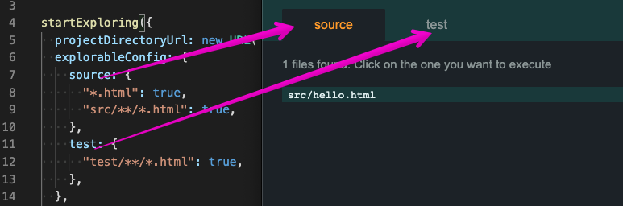
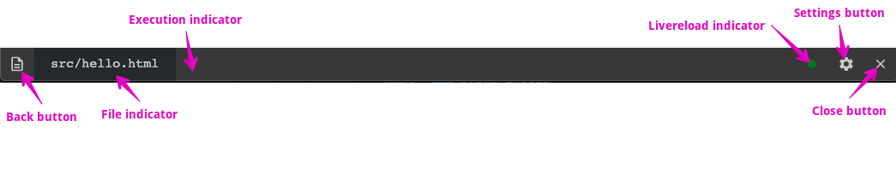
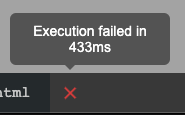
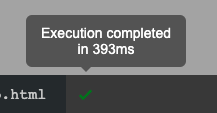
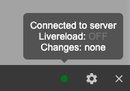
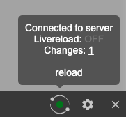
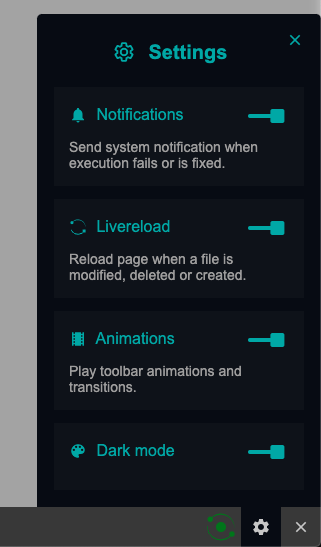
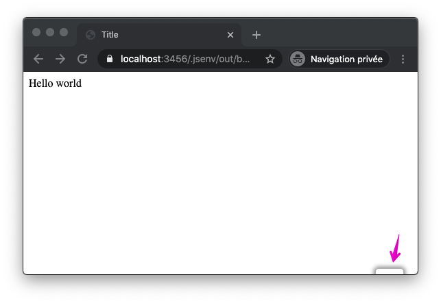

# Table of contents

- [Exploring presentation](#Exploring-presentation)
- [Exploring integration](#Exploring-integration)
- [startExploring](#startExploring)
- [jsenv toolbar](#jsenv-toolbar)

# Exploring presentation

Frontend projects often comes with a local server running on your machine.

These type of servers focuses on development. During development files change often and developper want a fast feedback to see effects of thoose changes.

You can use jsenv to start a server serving an html page containing a list of links to your project files. Each link goes to an url where your file will be executed. Thanks to this, any html file in your project can become an entry point. You can use it to debug a file in isolation, create a storybook and so on.

Jsenv call this `exploring`.

# Exploring integration

<details>
  <summary>1. Go to your project root directory</summary>

```console
cd /your-project
```

</details>

<details>
  <summary>2. Install <code>@jsenv/core</code> to your dependencies.</summary>

```console
npm install --save-dev @jsenv/core
```

</details>

<details>
  <summary>3. Create a file to start the exploring server</summary>

Copy [jsenv-core/docs/exploring/basic-project/start-exploring.js](./basic-project/start-exploring.js) into your project.

If your node version is above 13 and your `package.json` contains `"type": "module"` it's fine, go to step 4.

Otherwise be sure to change `start-exploring.js` file extension from `.js` to `.mjs`.

</details>

<details>
  <summary>4. Execute start exploring file </summary>

At this point exploring server will start in your project. Check `startExploring` documentation below.

</details>

# startExploring

`startExploring` is an async function starting a development server that transforms project files configured as explorable into an executable html page.

```js
import { startExploring } from "@jsenv/core"

startExploring({
  projectDirectoryUrl: "file:///Users/you/project/",
  explorableConfig: {
    source: {
      "src/**/*.html": true,
      "src/whatever/**/*.html": false,
    },
  },
})
```

— source code at [src/startExploring.js](../../src/startExploring.js).

# startExploring parameters

`startExploring` uses named parameters documented below.

To keep in mind: when you change a parameter don't forget to restart the server.

<details>
  <summary>explorableConfig</summary>

`explorableConfig` parameter is an object used to configure what files are explorable in your project. This is an optional parameter with a default value configured to match jsenv file structure. The exact value can be found in [src/jsenvExplorableConfig.js](../../src/jsenvExplorableConfig.js).

This parameter must be an object composed of other object where keys are relative or absolute urls. These urls are allowed to contain `*` and `**` that will be used for pattern matching as documented in https://github.com/jsenv/jsenv-url-meta#pattern-matching-behaviour.

Each group declared in `explorableConfig` are turned into tabs in jsenv exploring index page. These tabs are here to regroup files that goes together.
For instance you might want to have a tab for source files and one for test files.



</details>

<details>
  <summary>livereloading</summary>

`livereloading` parameter is a boolean controlling if the browser will auto reload when a file is saved. This is an optional parameter enabled by default.

Any request to a file inside your project is also considered as a dependency that can triggers a reload. It means if your html file or js file load assets such as image or css these asset files will also trigger livereloading when saved.

</details>

<details>
  <summary>watchConfig</summary>

`watchConfig` parameter is an object configuring which files are watched to trigger livereloading. This is an optional parameter with a default value configured to watch everything except git and node_modules directories. `watchConfig` reuse [explorableConfig](#explorableConfig) shape meaning keys are urls with pattern matching.

Example of a custom `watchConfig`:

```js
{
  "./*/**": false,
  "./*": true,
  "./src/**/*": true,
}
```

</details>

<details>
  <summary>toolbar</summary>

`toolbar` parameter is a boolean controlling if a script loading jsenv toolbar will be injected into html files. This parameter is optional and enabled by default.

The image below is a screenshot of this toolbar.


For more details check [jsenv toolbar](#jsenv-toolbar) section.

</details>

<details>
  <summary>Server parameters</summary>

Exploring server parameters are configured to let you use exploring right away. You might want to configure some of them to use a specific port or your own https certificate.

The following parameter controls the exploring server:

- [compileServerProtocol](https://github.com/jsenv/jsenv-server/blob/master/docs/start-server.md#protocol)
- [compileServerPrivateKey](https://github.com/jsenv/jsenv-server/blob/master/docs/start-server.md#privateKey)
- [compileServerCertificate](https://github.com/jsenv/jsenv-server/blob/master/docs/start-server.md#certificate)
- [compileServerIp](https://github.com/jsenv/jsenv-server/blob/master/docs/start-server.md#ip)
- [compileServerPort](https://github.com/jsenv/jsenv-server/blob/master/docs/start-server.md#port)
- [compileServerLogLevel](https://github.com/jsenv/jsenv-server/blob/master/docs/start-server.md#logLevel)

</details>

<details>
  <summary>Shared parameters</summary>

To avoid duplication some parameter are linked to a generic documentation.

- [projectDirectoryUrl](../shared-parameters.md#projectDirectoryUrl)
- [babelPluginMap](../shared-parameters.md#babelPluginMap)
- [convertMap](../shared-parameters.md#convertMap)
- [importDefaultExtension](../shared-parameters.md#importDefaultExtension)
- [jsenvDirectoryRelativeUrl](../shared-parameters.md#jsenvDirectoryRelativeUrl)

</details>

# startExploring return value

Using the return value is an advanced use case, in theory you should not need this.

`startExploring` returns the `compileServer`.

`compileServer` is created by `@jsenv/server`. You can read the `@jsenv/server` documentation on the return value to see the shape of these objects.
https://github.com/jsenv/jsenv-server/blob/master/docs/start-server.md#startServer-return-value.

Code below shows how you might use return value.

```js
import { startExploring } from "@jsenv/core"

const compileServer = await startExploring({
  projectDirectoryUrl: new URL("./", import.meta.url),
})

compileServer.stop()
```

# jsenv toolbar

The jsenv toolbar is injected at the bottom of the page by the exploring server. It is inside an iframe so that it cannot conflict with your css or js.

The toolbar is composed as shown in the following image:



<details>
  <summary>back button</summary>

This button is convenient to go back to exploring index.

</details>

<details>
  <summary>file input</summary>

This component display the file being executed. Useful to have it visible to remember what we are talking about.

</details>

<details>
  <summary>execution indicator</summary>

This component is an icon representing the html file execution state. The icon can be clicked to get more information as shown in the images below.

**executing**

html file assets and imports are being loaded, parsed and executed.


**failed**

a script with type module in the html file has thrown an error.



**completed**

html file execution is done without error.



</details>

<details>
  <summary>livereload indicator</summary>

This component is an icon representing the server connection state. The icon can be clicked to get more information.

**connecting**


> You should rarely see this in practice because connection is almost instant.

**connected with livereloading**

Exploring server works correctly and livereload is fully functionnal.


You can disable livereloading using `settings button`

**connected without livereloading**

Exploring server works correctly and livereload is disabled.



If files are modified while livereload is disabled the component is updated to give the information:

- This icon is different
- Number of changes is displayed and can be clicked to see what has changed since page was loaded.
- There is a reload link to encourage reloading the page



You can enable livereloading using `settings button`

**disconnected**

Happens after you click disconnect button


**failed**

Exploring server is down. Livereload will not work. You should check the terminal where exploring server was started.


</details>

<details>
  <summary>settings button</summary>

This component is a button opening a setting panel when clicked. Each setting is saved in the browser localStorage.



**Notification setting**

Show a notification when file execution fails, is still failing or is fixed.

**Livereload setting**

Useful to disable temporarily livereload for any legit reason you may have.

**Animation setting**

Useful in case the toolbar animation are annoying to you. There is very few of them like when it's opened or closed. It exists mostly because they more animation than that in the past.

**Dark mode setting**

Toogle between dark theme and light theme. Use this to keep a good contrast between the toolbar and the website behind it.

</details>

<details>
 <summary>close button</summary>

This button closes the toolbar to keep only the website. The toolbar can be shown back using a discrete box at the bottom right.



When you close toolbar this information is kept in browser localStorage to keep it hidden.

</details>
