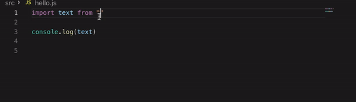
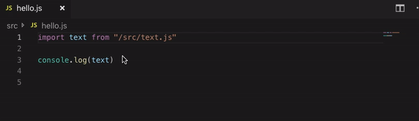

# Project relative import

A project relative import is an import starting with `/`.<br />

```js
import whatever from "/src/folder/file.js"
```

jsenv supports them and resolves `"/src/folder/file.js"` as relative to your project path.<br />

If you want to configure other tools to support them, this page is for you. Next parts explains how to make `eslint` and `vscode` compatible with import starting with `/`.

## Make eslint compatible

It concerns you only if you use `eslint-plugin-import` and I definitely recommend using it.<br />
— see [eslint plugin import on github](https://github.com/benmosher/eslint-plugin-import)

So if you use `eslint-plugin-import` you want it to work with `/`.<br />
To do that follow these steps:

1. Install `@jsenv/eslint-import-resolver`

```shell
npm install --save-dev @jsenv/eslint-import-resolver@4.7.0
```

2. Tell `eslint-plugin-import` to use a custom resolver

Inside `.eslintrc.js`, set `import/resolver` under `settings` as shown below.

```js
module.exports = {
  settings: {
    "import/resolver": {
      [`${__dirname}/node_modules/@jsenv/eslint-import-resolver/dist/node/main.js`]: {
        projectFolder: __dirname,
      },
    },
  },
}
```

## Make vscode compatible

At the root of your project create `.jsconfig.json` with the following content:

```json
{
  "compilerOptions": {
    "baseUrl": ".",
    "paths": {
      "/*": ["./*"]
    }
  }
}
```

Note: if you already have `.jsconfig.json`, add the following under `paths`

```json
{
  "/*": ["./*"]
}
```

Doing this will unlock various features in vscode like the two feature shown below.

- autocomplete suggestion for import starting with `/`. <br />

  I made a video recording vscode autocomplete suggestion for import starting with `/`. The gif below was generated from that video.



- `go to definition` on import starting with `/`.<br />

  I made a video recording vscode going to definition of an import starting with `/`. The gif below was generated from that video.


