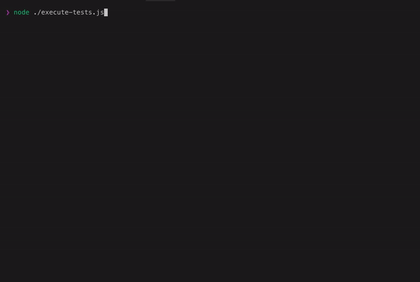
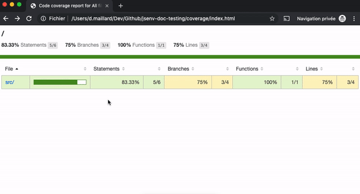

## Table of contents

- [Test presentation](#Test-presentation)
- [Test execution recorded](#Test-execution-recorded)
- [Test concrete example](#concrete-example)
  - [1 - Setup basic project](#1---setup-basic-project)
  - [2 - Execute tests](#2---execute-tests)
  - [3 - Generate test coverage](#3---generate-test-coverage)
    - [coverage/index.html](#coverageindexhtml)
    - [coverage/coverage.json](#coveragecoveragejson)
- [Test execution](#Test-execution)
  - [How test is executed](#How-test-is-executed)
  - [Execution error](#Execution-error)
  - [Execution timeout](#Execution-timeout)
  - [Execution disconnection](#Execution-disconnection)
  - [Execution completion](#Execution-completion)
  - [How to test async code](#How-to-test-async-code)
- [Test api example](#Test-api-example)
  - [api](./api.md)

## Test presentation

A test runs your code to ensure it works as expected.

Test are putting you in the shoes of someone using your code. In that perspective they document how to use your code and the variety of scenarios your code supports.<br />
Finally test helps to prevent accidentally breaking in the future what is working today.

Jsenv provides an api to execute your test files inside one or many environments. It means you can execute a given test file inside chromium and Node.js as long as code inside test file can executes in both.<br />

## Test execution recorded


Gif generated from [./test-terminal-recording.mp4](./test-terminal-recording.mp4). To run this on your machine, check [Concrete example](#Concrete-example) section.

## Concrete example

### 1 - Setup basic project

```console
git clone https://github.com/jsenv/jsenv-core.git
```

```console
cd ./jsenv-core/docs/test/basic-project
```

```console
npm install
```

### 2 - Execute tests

```console
node ./execute-test-plan.js
```

It will execute all your tests as shown in [Recorded example](#Recorded-example)

### 3 - Generate test coverage

```console
node ./execute-test-plan.js --cover
```

It will execute tests and generate `./coverage/` directory with files corresponding to your test coverage.

#### coverage/index.html

The gif below shows how you can explore your test coverage by opening `coverage/index.html` in your browser.



#### coverage/coverage.json

It is your test plan coverage in JSON format. This format was created by [istanbul](https://github.com/gotwarlost/istanbul) and can be given to coverage tools.

This file exists to be provided to some code coverage tool.
For instance you might want to send `coverage.json` to codecov.io inside during continuous integration workflow.<br />
— see [uploading coverage to codecov.io](./uploading-coverage-to-codecov.md)

## Test execution

Each test file will be executed in his own browser or node.js process.

It reduces chances that a file execution have a side effect on an other file execution.
For instance executing code with an infinite loop crashes browser or node.js process. In that scenario that file would not prevent other file executions.<br />
It also allows to execute files concurrently increasing speed on machine with mutiple processors.

Currently jsenv provides 3 possible test execution environments, called `platforms`:

- A chromium browser
- A chromium browser tab
- A node process

### How test is executed

Test is executed by something equivalent to a dynamic import.

```js
await import("file:///file.test.js")
```

If dynamic import resolves, execution is considered successfull.<br />
If dynamic import rejects, execution is considered errored.<br />
If dynamic import takes too long to settle, execution is considered timedout.<br />

Once the execution becomes either successfull, errored or timedout jsenv stops the platform launched to execute the test. Inside a node process there is a special behaviour where jsenv sends `SIGINIT` signal to the node process executing your test. After 8s, if the node process has not exited by its own it is killed by force.

### Execution error

Any value thrown during file execution sets execution status to errored and test is considered as failed.

```js
throw new Error("here")
```

### Execution timeout

Execution taking longer than an allocated amout of milliseconds sets execution status to timedout and test is considered as failed.

```js
await new Promise(() => {})
```

Note: By default an execution is given 30s before being considered as a timeout.

### Execution disconnection

Platform disconnected during file execution sets execution status to disconnected and test is considered as failed.

```js
while (true) {}
```

Note: This code might either crash the platform resulting in disconnected execution or never completes nor throw resulting in a timedout execution.

### Execution completion

When none of the aboves scenario occurs, execution status is success and test is considered as completed.

```js
const actual = 10 + 10
const expected = 20
if (actual !== expected) {
  throw new Error(`10 + 10 should be 20`)
}
```

Note: An empty file is a completed test.

### How to test async code

Top level await is a standard (and damn cool) way to make your top level code execution asynchronous. Use it to test async code.

```js
const actual = await Promise.resolve(42)
const expected = 42
if (actual !== expected) throw new Error("should be 42")
```

Without top level await your execution is considered done while your code is still executing.

```js
console.log("execution start")
;(async () => {
  const actual = await Promise.resolve(42)
  const expected = 42
  if (actual !== expected) throw new Error("should be 42")
  console.log("test done")
})()
console.log("execution end")
```

Logs

```console
execution start
execution end
test done
```

If jsenv executed that code, platform would be stopped after `execution end` logs and `test done` would never happen.

## Test api example

The following code uses `@jsenv/core` to execute every files ending with `test.js` inside a project directory.

```js
const { executeTestPlan, launchNode } = require("@jsenv/core")
const { launchChromium } = require("@jsenv/chromium-launcher")

executeTestPlan({
  projectDirectoryPath: __dirname,
  testPlan: {
    "./**/*.test.js": {
      node: {
        launch: launchNode,
      },
      chromium: {
        launch: launchChromium,
      },
    },
  },
})
```

If you want to know more check the [api documentation](./api.md)
