<!-- TITLE: C) Build -->

<!-- PLACEHOLDER_START:NAV_PREV_NEXT -->

<table>
  <tr>
    <td width="2000px" align="left" nowrap>
      <a href="../b_dev/b_dev.md">&lt; B) Dev</a>
    </td>
    <td width="2000px" align="center" nowrap>
      C) Build
    </td>
    <td width="2000px" align="right" nowrap>
      <a href="../d_test/d_test.md">&gt; D) Test</a>
    </td>
  </tr>
</table>

<!-- PLACEHOLDER_END -->

## Build Types: Apps vs Packages

Jsenv can be used for two main build scenarios:

1. **Building entire applications for the web (browser)** - This is what this page focuses on
2. **Building packages** - For creating reusable packages that can be consumed by Node.js, browsers, or both

This page specifically covers **building entire web applications** that will be deployed and run in browsers. The build process optimizes your application files, handles dependencies, and creates a production-ready version.

For building packages (libraries, utilities, etc.), see [J) Build a package](../j_build_a_package/j_build_a_package.md).

---

This page explains how jsenv can be used to generate an optimized version of your source files into a specified directory.

Best parts of jsenv build:

- Large browser support.
- **Precise cache invalidation**: versioning invalidates only what has changed.
- Support for `<script type="importmap">` with fallback if necessary.
- **top level await** support.
- `import.meta.url` and `import.meta.resolve` support.
- Support for module scripts: `<script type="module" src="./file.js">`.
- Support for inline module scripts: `<script type="module">console.log("hello");</script>`.
- Support for classic scripts: `<scrit src="./file.js">`.
- Support for inline classic script: `<script>console.log("hello");</script>`.
- Support for inline style: `<style>body: { color: orange; }</style>`.
- Support for module workers: `new Worker("./file.js", { type: "module"});`.

And many more features...

<!-- PLACEHOLDER_START:TOC_INLINE -->

# Table of contents

<ol>
  <li>
    <a href="#1-usage">
      Usage
    </a>
      <ul>
        <li>
          <a href="#11-project-file-structure">
            Project file structure
          </a>
        </li>
        <li>
          <a href="#12-generating-a-build">
            Generating a build
          </a>
        </li>
      </ul>
  </li>
  <li>
    <a href="#2-features">
      Features
    </a>
      <ul>
        <li>
          <a href="#21-browser-support">
            Browser support
          </a>
        </li>
        <li>
          <a href="#22-build-directory-structure">
            Build directory structure
          </a>
        </li>
        <li>
          <a href="#23-bundling">
            Bundling
          </a>
        </li>
        <li>
          <a href="#24-minification">
            Minification
          </a>
        </li>
        <li>
          <a href="#25-build-urls">
            Build urls
          </a>
        </li>
        <li>
          <a href="#26-precise-cache-invalidation">
            Precise cache invalidation
          </a>
        </li>
        <li>
          <a href="#27-resource-hints">
            Resource hints
          </a>
        </li>
        <li>
          <a href="#28-plugins">
            plugins
          </a>
        </li>
        <li>
          <a href="#29-symbiosis-with-service-worker">
            Symbiosis with service worker
          </a>
        </li>
        <li>
          <a href="#210-sourcemaps">
            sourcemaps
          </a>
        </li>
      </ul>
  </li>
  <li>
    <a href="#3-how-to-serve-build-files">
      How to serve build files
    </a>
      <ul>
        <li>
          <a href="#31-builddirectoryurl">
            buildDirectoryUrl
          </a>
        </li>
        <li>
          <a href="#32-port">
            port
          </a>
        </li>
        <li>
          <a href="#33-https">
            https
          </a>
        </li>
      </ul>
  </li>
</ol>

<!-- PLACEHOLDER_END -->

# 1. Usage

This section shows how to build your project source files using jsenv.

## 1.1 Project file structure

Initially, the project structure looks like this:

<pre>
project/
  src/
    index.html
  package.json
</pre>

After running a build, the structures changes to:

```diff
project/
+ dist/
+   index.html
+ scripts/
+    build.mjs
  src/
    index.html
  package.json
```

_scripts/build.mjs_:

```js
import { build } from "@jsenv/core";

await build({
  sourceDirectoryUrl: import.meta.resolve("../src/"),
  buildDirectoryUrl: import.meta.resolve("../dist/"),
  entryPoints: {
    "./index.html": {},
  },
});
```

## 1.2 Generating a build

To generate a build, first install the necessary dependencies:

```console
npm i --save-dev @jsenv/core
```

Once ready, you can generate the build by running the following command:

```console
node ./scripts/build.mjs
```

You should see the following output in the terminal:



# 2. Features

## 2.1 Browser support

By default, the build generates code compatible with the following browsers:

- Chrome 64+
- Safari 11.3+
- Edge 79+
- Firefox 67+
- Opera 51+
- Safari on IOS 12+
- Samsung Internet 9.2+

You can adjust browser support using `runtimeCompat`:

```diff
import { build } from "@jsenv/core";

await build({
  sourceDirectoryUrl: import.meta.resolve("../src/"),
  buildDirectoryUrl: import.meta.resolve("../dist/"),
  entryPoints: {
    "./main.html": {
      buildRelativeUrl: "./index.html",
+     runtimeCompat: {
+      chrome: "55",
+      edge: "15",
+      firefox: "52",
+      safari: "11",
+    },
    },
  },
});
```

The build ensures transformations are performed based on the browser support specified.
For example, if `<script type="module">` can be preserved, it will be.

### 2.1.1 Maximal browser support

The maximum compatibility that can be obtained after build is:

- Chrome 7+
- Safari 5.1+
- Edge 12+
- Firefox 2+
- Opera 12+
- Safari on IOS 6+
- Samsung Internet 1+

### 2.1.2 Same build for all browsers

When runtimeCompat includes browsers that do not support `<script type="module">`, it might seem logical to generate two builds and use the [`<script nomodule>`](https://developer.mozilla.org/en-US/docs/Web/HTML/Element/script#attr-nomodule)<sup>↗</sup>. However, based on tests with large codebases and user data, we found there is no significant performance impact. Generating a second set of files also introduces extra costs, such as:

- Manual and automated testing on older browsers
- Increased build time

For these reasons jsenv generates a single `<script>` tag:

```html
<script src="/dist/main.nomodule.js"></script>
```

If you prefer, you can generate multiple sets of files by calling build multiple times with different `runtimeCompat` settings and `buildDirectoryUrl`.

### 2.1.3 Polyfills

Jsenv does not inject polyfills. If code relies on features like _Promise_ that are not supported in certain browsers, you must add the relevant polyfills. A recommended resource is https://polyfill.io<sup>↗</sup>.

## 2.2 Build directory structure

A typical build results in the following file structure:

```
dist/
  js/
    main.js
    app.js
  css/
    main.css
  index.html
```

### 2.2.1 Entry points

The `entryPoints` object defines which source files to include in the build.
These can be HTML, CSS, JS, etc. Each entry point value is an object configuring the build.
For example `buildRelativeUrl` configures the file name in the build directory:

```js
import { build } from "@jsenv/build";

await build({
  sourceDirectoryUrl: import.meta.resolve("../src/"),
  buildDirectoryUrl: import.meta.resolve("../dist/"),
  entryPoints: {
    "./index.html": {
      buildRelativeUrl: "./index_after_build.html",
    },
    "./about.html": {
      buildRelativeUrl: "./about_after_build.html",
    },
  },
});
```

```
dist/
  js/
    main.js
    app.js
  css/
    main.css
  index_after_build.html
  about_after_build.html
```

### 2.2.2 Assets directory

You can organize assets into a dedicated directory by using `assetsDirectory`:

```js
import { build } from "@jsenv/core";

await build({
  sourceDirectoryUrl: import.meta.resolve("../src/"),
  buildDirectoryUrl: import.meta.resolve("../dist/"),
  entryPoints: {
    "./index.html": {
      assetsDirectory: "assets/",
    },
  },
});
```

This will produce the following structure:

```
dist/
  assets/
    js/
      main.js
      app.js
    css/
      main.css
  index.html
```

## 2.3 Bundling

Bundling combines multiple files into fewer files, improving performance. Bundling is enabled by default.

The bundlers used are:

| File type | bundler used                                                               |
| --------- | -------------------------------------------------------------------------- |
| js module | [rollup](https://github.com/rollup/rollup)<sup>↗</sup>                     |
| css       | [lightningcss](https://github.com/parcel-bundler/lightningcss)<sup>↗</sup> |

You can configure which files to bundle:

```js
import { build } from "@jsenv/core";

await build({
  sourceDirectoryUrl: import.meta.resolve("../src/"),
  buildDirectoryUrl: import.meta.resolve("../dist/"),
  entryPoints: {
    "./index.html": {
      bundling: {
        js_module: false,
        css: true,
      },
    },
  },
});
```

Or completely disable bundling by setting `bundling: false`.

### 2.3.1 Js module chunks

Use the `chunks` parameter to assign source files to specific build files. For instance, node module files and `a.js` can be grouped into `vendors.js`:

```js
import { build } from "@jsenv/core";

await build({
  sourceDirectoryUrl: import.meta.resolve("../src/"),
  buildDirectoryUrl: import.meta.resolve("../dist/"),
  entryPoints: {
    "./index.html": {
      bundling: {
        js_module: {
          chunks: {
            vendors: {
              "file:///**/node_modules/": true,
              "./a.js": true,
            },
          },
        },
      },
    },
  },
});
```

The source files not assigned by `chunks` are distributed optimally into build files.

## 2.4 Minification

Minification reduces file size and is enabled by default.

The minifiers used are:

| File type                | Minifier used                                                              |
| ------------------------ | -------------------------------------------------------------------------- |
| js module and js classic | [terser](https://github.com/terser/terser)<sup>↗</sup>                     |
| html and svg             | [html-minifier](https://github.com/kangax/html-minifier)<sup>↗</sup>       |
| css                      | [lightningcss](https://github.com/parcel-bundler/lightningcss)<sup>↗</sup> |
| json                     | White spaces are removed using JSON.stringify                              |

You can configure which files to minify:

```js
import { build } from "@jsenv/core";

await build({
  sourceDirectoryUrl: import.meta.resolve("../src/"),
  buildDirectoryUrl: import.meta.resolve("../dist/"),
  entryPoints: {
    "./index.html": {
      minification: {
        html: false,
        css: true,
        js_classic: true,
        js_module: true,
        json: false,
        svg: false,
      },
    },
  },
});
```

To disable minification, use `minification: false`.

## 2.5 Build urls

By default, URLs in the build are absolute and versioned:

_src/index.html_:

```html
<script type="module" src="./main.js"></script>
```

Becomes _dist/index.html_:

```html
<script type="module" src="/js/main.js?v=16e5f70d"></script>
```

### 2.5.1 Versioning

By default, versioning is added as a URL search parameter:

```html
<script type="module" src="/js/main.js?v=16e5f70d"></script>
```

You can switch to filename versioning:

```js
import { build } from "@jsenv/core";

await build({
  sourceDirectoryUrl: import.meta.resolve("../src/"),
  buildDirectoryUrl: import.meta.resolve("../dist/"),
  entryPoints: {
    "./main.html": {
      versioningMethod: "filename",
    },
  },
});
```

Example of a build url when versioning via filename:

```diff
- <script type="module" src="/js/main.js?v=16e5f70d"></script>
+ <script type="module" src="/js/main-16e5f70d.js"></script>
```

Or disable versioning entirely:

```js
import { build } from "@jsenv/core";

await build({
  sourceDirectoryUrl: import.meta.resolve("../src/"),
  buildDirectoryUrl: import.meta.resolve("../dist/"),
  entryPoints: {
    "./main.html": {
      versioning: false,
    },
  },
});
```

Example of a build url when versioning is disabled:

```diff
- <script type="module" src="/js/main.js?v=16e5f70d"></script>
+ <script type="module" src="/js/main.js"></script>
```

### 2.5.2 Base

You can configure the base URL for all files in the build:

```js
import { build } from "@jsenv/core";

await build({
  sourceDirectoryUrl: import.meta.resolve("../src/"),
  buildDirectoryUrl: import.meta.resolve("../dist/"),
  entryPoints: {
    "./main.html": {
      base: "https://cdn.example.com",
    },
  },
});
```

Example of a build url with `base: "https://cdn.example.com"`:

```diff
- <script type="module" src="/js/main.js?v=16e5f70d"></script>
+ <script type="module" src="https://cdn.example.com/js/main.js?v=16e5f70d"></script>
```

## 2.6 Precise cache invalidation

Build [avoids cascading hash changes](https://bundlers.tooling.report/hashing/avoid-cascade/)<sup>↗</sup> by using [`<script type="importmap">`](https://github.com/WICG/import-maps)<sup>↗</sup> element.

The following browsers are supporting importmap:

- Chrome 89+
- Safari 16.4+
- Edge 89+
- Firefox 108+
- Opera 76+
- Safari on IOS 16.4+
- Samsung Internet 15+

If the `runtimeCompat` doesn't support importmap, jsenv converts js modules to the [systemjs format](https://github.com/systemjs/systemjs). This allow to keep versioning without introducing cascading hash changes.

## 2.7 Resource hints

During the build process, any resource hints (like `<link rel="preload">`) in the source files are updated to reflect the built files. If necessary, the build will also inject or remove resource hints.

### 2.7.2 Resource hint injection

For example, if your project contains preload links for `boot.js` and `app.js`:

```
project/
 src/
   boot.js
   app.js
   index.html
   ...many js files...
```

```html
<link rel="preload" href="./boot.js" as="script" crossorigin="" />
<link rel="preload" href="./app.js" as="script" crossorigin="" />
```

The build might introduce new preloads to improve code reuse:

```html
<link rel="preload" href="/js/boot.js?v=12345678" as="script" crossorigin="" />
<link
  rel="preload"
  href="/js/generated.js?v=12367845"
  as="script"
  crossorigin=""
/>
<link rel="preload" href="/js/app.js?v=87654321" as="script" crossorigin="" />
```

### 2.7.1 Resource hint removal

```html
<link rel="preload" href="./main.js" as="script" crossorigin="" />
```

☝️ If “main.js” is not referenced elsewhere in the code, the following warning will appear during the build:

```console
⚠ remove resource hint because cannot find "file:///demo/main.js" in the graph
```

To remove this warning, simply delete the resource hint from the HTML file.

Similarly, when a file is no longer needed after build (such as when it is bundled into another file), a different warning is shown:

```console
⚠ remove resource hint on "file:///demo/main.js" because it was bundled
```

In this case, you can also remove the resource hint from the HTML file as it is no longer necessary after the build.

## 2.8 plugins

An array of custom jsenv plugins that will be used during the build process.
For more information, refer to [G) Plugins](../g_plugins/g_plugins.md).

## 2.9 Symbiosis with service worker

Here’s what happens during the build when code registers a service worker:

_index.html_:

```html
<!doctype html>
<html>
  <head>
    <title>Title</title>
    <meta charset="utf-8" />
    <link rel="icon" href="data:," />
  </head>

  <body>
    Hello world
    <script type="module" src="./main.js"></script>
    <script>
      window.navigator.serviceWorker.register("./sw.js");
    </script>
  </body>
</html>
```

_sw.js_:

```js
const urls = ["/"];

const addUrlsToCache = async (urls) => {
  const cache = await caches.open("v1");
  await cache.addAll(urls);
};

self.addEventListener("install", (event) => {
  event.waitUntil(addUrlsToCache(urls));
});
```

1. The build detects `navigator.serviceWorker.register` and consider _sw.js_ as the service worker entry file.
2. The build injects the following code at the top of _sw.js_:

```diff
+ self.resourcesFromJsenvBuild = {
+  "/main.html": {
+    "version": "a3b3b305"
+  },
+  "/js/main.js": {
+    "version": "54f517a9",
+    "versionedUrl": "/js/main.js?v=54f517a9"
+  },
+ };
```

Thanks to this, the service worker becomes aware of all the files generated during the build and can cache all URLs to make the page available offline.

To accomplish this, the code inside sw.js needs to be adjusted as follows:

```diff
  const urls = ["/'];

+ const resourcesFromJsenvBuild = self.resourcesFromJsenvBuild;
+ if (resourcesFromJsenvBuild) {
+   Object.keys(resourcesFromJsenvBuild).forEach((key) => {
+     const resource = resourcesFromJsenvBuild[key]
+     if (resource.versionedUrl) {
+       urls.push(resource.versionedUrl);
+     }
+   });
+ }
```

If you don’t have your own service worker, you can use [@jsenv/service-worker](../../../packages/frontend/service-worker)

## 2.10 sourcemaps

Same as the `sourcemaps` options in [B) Dev](../b_dev/b_dev.md#28-sourcemaps), but default value is `"none"`.

# 3. How to serve build files

You can serve build files using any regular web server like Nginx, Apache, or other static file servers.

If you don't already have a server set up, jsenv provides a simple server to help you get started quickly:

```js
import { startBuildServer } from "@jsenv/core";

const buildServer = await startBuildServer({
  buildDirectoryUrl: import.meta.resolve("../dist/"),
  port: 8000,
});
```

This is particularly useful for local testing. For production environments, you might prefer using specialized servers optimized for static content delivery.

## 3.1 buildDirectoryUrl

This is a required parameter. It should be a string or URL pointing to the directory where the build files are stored.

## 3.2 port

This specifies the port the build server will listen on (default is `9779`). If you pass `0`, it will automatically use a random available port.

## 3.3 https

Same as the `https` option in [B) Dev](../b_dev/b_dev.md#210-https)

<!-- PLACEHOLDER_START:NAV_PREV_NEXT -->

<table>
  <tr>
    <td width="2000px" align="left" nowrap>
      <a href="../b_dev/b_dev.md">&lt; B) Dev</a>
    </td>
    <td width="2000px" align="center" nowrap>
      C) Build
    </td>
    <td width="2000px" align="right" nowrap>
      <a href="../d_test/d_test.md">&gt; D) Test</a>
    </td>
  </tr>
</table>

<!-- PLACEHOLDER_END -->
