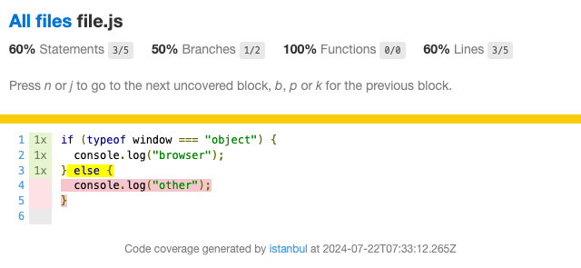
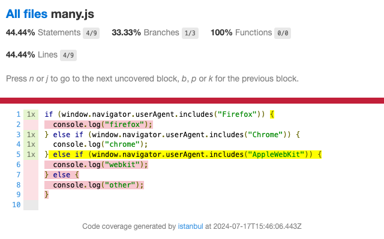
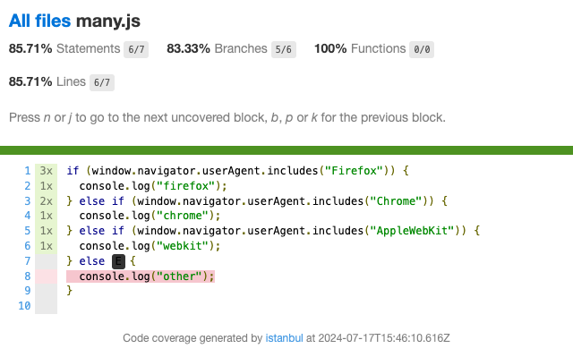

<!-- TITLE: D) Test -->

<!-- PLACEHOLDER_START:NAV_PREV_NEXT -->

<table>
  <tr>
    <td width="2000px" align="left" nowrap>
      <a href="../c_build/c_build.md">&lt; C) Build</a>
    </td>
    <td width="2000px" align="center" nowrap>
      D) Test
    </td>
    <td width="2000px" align="right" nowrap>
      <a href="../e_referencing_files/e_referencing_files.md">&gt; E) Referencing files</a>
    </td>
  </tr>
<table>

<!-- PLACEHOLDER_END -->

This page documents how jsenv can be used to write and execute tests in a web browser. For Node.js testing, refer to [I) Test in Node.js](../i_test_in_node/i_test_in_node.md).

Key features of jsenv tests:

- [debugging a test file is identical to debugging a source file](#14-executing-a-single-test).
- Test execution is standard making it easy to switch between source and test files.
- [Isolated environment](#33-isolated-environment); each test file runs in a a dedicated runtime.
- Test files can be executed in [Chrome, Firefox and Safari](#32-execute-on-more-browsers)
- [Smart parallelism](#34-parallelism)
- [Human friendly logs](../../../packages/related/test/tests/test_plan_execution/logs/browser/output/console.spec.html.gif): Dynamic, colorful and easy to read.

<!--
When coding, we spend most of our time working on source files. At some point we switch from source files to test files. Suddenly things are different:

- code does not execute as it would in source files
- some tools are used differently in test files, some cannot be used at all
- you are forced to code in a certain way that is completely different from the one in source files

This huge gap between source files and test files creates a context switching costing a lot of cognitive energy.
-->

<!-- PLACEHOLDER_START:TOC_INLINE -->

<details>
  <summary>Table of contents</summary>
  <ul>
    <li>
      <a href="#1-usage">
        1. Usage
      </a>
        <ul>
          <li>
            <a href="#11-project-file-structure">
              1.1 Project file structure
            </a>
          </li>
          <li>
            <a href="#12-writing-test">
              1.2 Writing test
            </a>
          </li>
          <li>
            <a href="#13-executing-tests">
              1.3 Executing tests
            </a>
          </li>
          <li>
            <a href="#14-executing-a-single-test">
              1.4 Executing a single test
            </a>
          </li>
        </ul>
    </li>
    <li>
      <a href="#2-assertions">
        2. Assertions
      </a>
    </li>
    <li>
      <a href="#3-features">
        3. Features
      </a>
        <ul>
          <li>
            <a href="#31-web-server-autostart">
              3.1 Web server autostart
            </a>
          </li>
          <li>
            <a href="#32-execute-on-more-browsers">
              3.2 Execute on more browsers
            </a>
          </li>
          <li>
            <a href="#33-isolated-environment">
              3.3 Isolated environment
            </a>
          </li>
          <li>
            <a href="#34-parallelism">
              3.4 Parallelism
            </a>
          </li>
          <li>
            <a href="#35-allocated-time-per-test">
              3.5 Allocated time per test
            </a>
          </li>
          <li>
            <a href="#36-code-coverage">
              3.6 Code coverage
            </a>
          </li>
          <li>
            <a href="#37-keep-browser-opened">
              3.7 Keep browser opened
            </a>
          </li>
          <li>
            <a href="#38-configuring-runtime">
              3.8 Configuring runtime
            </a>
          </li>
        </ul>
    </li>
    <li>
      <a href="#4-javascript-api">
        4. JavaScript API
      </a>
        <ul>
          <li>
            <a href="#41-testplanresult">
              4.1 testPlanResult
            </a>
          </li>
        </ul>
    </li>
  </ul>
</details>

<!-- PLACEHOLDER_END -->

# 1. Usage

This section demonstrates how to write execute tests for a source file using jsenv.

## 1.1 Project file structure

<pre>
project/
  src/
    <strong>sum.js</strong>
    index.html
  package.json
</pre>

Let's write a test for _sum.js_:

```js
export const sum = (a, b) => a + b;
```

To test sum.js, the following files are needed:

```diff
project/
+ scripts/
+   dev.mjs
+   test.mjs
  src/
    sum.js
+   sum.test.html
    index.html
  package.json
```

## 1.2 Writing test

_src/sum.test.html_

```html
<!doctype html>
<html>
  <head>
    <title>Title</title>
    <meta charset="utf-8" />
    <link rel="icon" href="data:," />
  </head>

  <body>
    <script type="module">
      import { sum } from "./sum.js";

      const actual = sum(1, 2);
      const expect = 3;
      if (actual !== expect) {
        throw new Error(`sum(1,2) should return 3, got ${actual}`);
      }
    </script>
  </body>
</html>
```

## 1.3 Executing tests

_scripts/dev.mjs_: Start a web server, will be used to execute _sum.test.html_ in a browser.

```js
import { startDevServer } from "@jsenv/core";

await startDevServer({
  sourceDirectoryUrl: new URL("../src/", import.meta.url),
  port: 3456,
});
```

_scripts/test.mjs_: Execute test file(s).

```js
import { executeTestPlan, chromium } from "@jsenv/test";

await executeTestPlan({
  rootDirectoryUrl: new URL("../", import.meta.url),
  testPlan: {
    "./src/**/*.test.html": {
      chromium: {
        runtime: chromium(),
      },
    },
  },
  webServer: {
    origin: "http://localhost:3456",
    rootDirectoryUrl: new URL("../src/", import.meta.url),
    moduleUrl: new URL("./dev.mjs", import.meta.url),
  },
});
```

Before executing test, install dependencies:

```console
npm i --save-dev @jsenv/core
npm i --save-dev @jsenv/test
npm i --save-dev @playwright/browser-chromium
```

☝️ [playwright](https://github.com/microsoft/playwright)<sup>↗</sup> is used by `@jsenv/test` to start a web browser (Chromium).

Run the tests with the following command:

```console
node ./scripts/test.mjs
```

The terminal will display the following output:



## 1.4 Executing a single test

In a real project there may be many test files:

```
project/
  src/
    sum.test.html
    foo.test.html
    bar.test.html
    ... and so on ...
```

Each test file can be executed in isolation, directly in the browser:


The page is blank because _sum.test.html_ execution completed without error and without rendering anything. Some test maye render UI but this is not the case here.

Debugging test execution can be done using browser dev tools:


# 2. Assertions

The example above compares actual and expect without an assertion library. In practice, tests often use assertion libraries. Below is an example using [@jsenv/assert](../../../packages/independent/assert). Note that any assertion library can be used.

```diff
+ import { assert } from "@jsenv/assert";
import { sum } from "./sum.js";

const actual = sum(1, 2);
const expect = 3;
- if (actual !== expect) {
-   throw new Error(`sum(1,2) should return 3, got ${actual}`);
- }
+ assert({ actual, expect });
```

# 3. Features

## 3.1 Web server autostart

Your web server is automatically started if needed. This is doe using the `webServer` parameter.

If server is already running at `webServer.origin`:

1. Tests are executed using existing server.

If no server is running at `webServer.origin`:

1. `webServer.moduleUrl` or `webServer.command` is executed in a separate process.
2. The code waits for the server to start. If it doesn't start within 5 seconds, an error is thrown.
3. Test are executed using the server started in step 1.
4. After tests complete, the server is stopped by killing the process.

## 3.2 Execute on more browsers

```js
import { executeTestPlan, chromium, firefox, webkit } from "@jsenv/test";

await executeTestPlan({
  rootDirectoryUrl: new URL("../", import.meta.url),
  testPlan: {
    "./src/**/*.test.html": {
      chromium: {
        runtime: chromium(),
      },
      firefox: {
        runtime: firefox(),
      },
      webkit: {
        runtime: webkit(),
      },
    },
  },
  webServer: {
    origin: "http://localhost:3456",
    rootDirectoryUrl: new URL("../src/", import.meta.url),
    moduleUrl: new URL("./dev.mjs", import.meta.url),
  },
});
```

Before executing tests, install Firefox and Webkit dependencies:

```console
npm i --save-dev @playwright/browser-firefox
npm i --save-dev @playwright/browser-webkit
```

The terminal output:



## 3.3 Isolated environment

Each test is executed in a browser tab using one instance of the browser.

For further isolation, you can dedicate a browser instance per test by using chromiumIsolatedTab instead of chromium. The same applies to Firefox and WebKit.

```js
import { executeTestPlan, chromiumIsolatedTab } from "@jsenv/test";

await executeTestPlan({
  rootDirectoryUrl: new URL("../", import.meta.url),
  testPlan: {
    "./src/**/*.test.html": {
      chromium: {
        runtime: chromiumIsolatedTab(),
      },
    },
  },
  webServer: {
    origin: "http://localhost:3456",
    rootDirectoryUrl: new URL("../src/", import.meta.url),
    moduleUrl: new URL("./dev.mjs", import.meta.url),
  },
});
```

## 3.4 Parallelism

Executions are started sequentially without waiting for the previous one to finish. Parallelism can be configured using the `parallel` parameter.

```js
import { executeTestPlan, chromium } from "@jsenv/test";

await executeTestPlan({
  rootDirectoryUrl: new URL("../", import.meta.url),
  parallel: {
    max: "50%",
    maxCpu: "50%",
    maxMemory: "50%",
  },
  testPlan: {
    "./src/**/*.test.html": {
      chromium: {
        runtime: chromium(),
      },
    },
  },
  webServer: {
    origin: "http://localhost:3456",
    rootDirectoryUrl: new URL("../src/", import.meta.url),
    moduleUrl: new URL("./dev.mjs", import.meta.url),
  },
});
```

### 3.4.1 parallel.max

Controls the maximum number of parallel executions.

| max | Max executions in parallel            |
| --- | ------------------------------------- |
| 1   | Only one (disable parallelism)        |
| 5   | 5                                     |
| 80% | 80% of cores available on the machine |

The default value is 80%: For a machine with 10 processors, up to 8 executions can run in parallel.

Parallelism can also be disabled with `parallel: false` which is equivalent to `parallel: { max: 1 }`.

### 3.4.2 parallel.maxCpu

Prevents new executions from starting if CPU usage is too high

The default value is 80%. New executions will start as long as CPU usage is below 80% of the total available CPU.

### 3.4.3 parallel.maxMemory

Prevents new executions from starting if memory usage is too high.

The default value is 50%. New executions will start as long as memory usage is below 50% of the total available memory.

## 3.5 Allocated time per test

Each test file is given 30s to execute.
If this duration is exceeded, the browser tab is closed, and the execution is marked as failed.
This duration can be configured as shown below:

```js
import { executeTestPlan, chromium } from "@jsenv/test";

await executeTestPlan({
  rootDirectoryUrl: new URL("../", import.meta.url),
  testPlan: {
    "./src/**/*.test.html": {
      chromium: {
        runtime: chromium(),
        allocatedMs: 60_000,
      },
    },
  },
  webServer: {
    origin: "http://localhost:3456",
    rootDirectoryUrl: new URL("../src/", import.meta.url),
    moduleUrl: new URL("./dev.mjs", import.meta.url),
  },
});
```

## 3.6 Code coverage

You can generate HTML files showing code coverage for test executions:



The coverage above was generated by the following code:

```js
import { executeTestPlan, chromium, reportCoverageAsHtml } from "@jsenv/test";

const testResult = await executeTestPlan({
  rootDirectoryUrl: new URL("../", import.meta.url),
  testPlan: {
    "./src/**/*.test.html": {
      chromium: {
        runtime: chromium(),
      },
    },
  },
  webServer: {
    origin: "http://localhost:3456",
    rootDirectoryUrl: new URL("../src/", import.meta.url),
    moduleUrl: new URL("./dev.mjs", import.meta.url),
  },
  coverage: true,
});

reportCoverageAsHtml(testResult, new URL("./coverage/", import.meta.url));
```

### 3.6.1 Coverage json

Coverage can also be written to a JSON file.

```js
import { executeTestPlan, chromium, reportCoverageAsJson } from "@jsenv/test";

const testResult = await executeTestPlan({
  rootDirectoryUrl: new URL("../", import.meta.url),
  testPlan: {
    "./src/**/*.test.html": {
      chromium: {
        runtime: chromium(),
      },
    },
  },
  webServer: {
    origin: "http://localhost:3456",
    rootDirectoryUrl: new URL("../src/", import.meta.url),
    moduleUrl: new URL("./dev.mjs", import.meta.url),
  },
  coverage: true,
});

reportCoverageAsJson(testResult, new URL("./coverage.json", import.meta.url));
```

This JSON file can be used with other tools, such as https://github.com/codecov/codecov-action.

### 3.6.2 Coverage from multiple browsers

Now let's say we want to get code coverage for a file where code behaves differently depending on the browser:

```js
if (window.navigator.userAgent.includes("Firefox")) {
  console.log("firefox");
} else if (window.navigator.userAgent.includes("Chrome")) {
  console.log("chrome");
} else if (window.navigator.userAgent.includes("AppleWebKit")) {
  console.log("webkit");
} else {
  console.log("other");
}
```

The file is executed by the following HTML file:

```html
<!doctype html>
<html>
  <head>
    <title>Title</title>
  </head>

  <body>
    <script type="module" src="./demo.js"></script>
  </body>
</html>
```

Execute the HTML file in Firefox, Chrome, and Webkit, and generate the coverage:

```js
import {
  executeTestPlan,
  chromium,
  firefox,
  webkit,
  reportCoverageAsHtml,
} from "@jsenv/test";

const testPlanResult = await executeTestPlan({
  rootDirectoryUrl: new URL("../", import.meta.url),
  testPlan: {
    "./client/**/many.test.html": {
      chromium: {
        runtime: chromium(),
      },
      firefox: {
        runtime: firefox(),
      },
      webkit: {
        runtime: webkit(),
      },
    },
  },
  webServer: {
    origin: "http://localhost:3456",
    rootDirectoryUrl: new URL("../client/", import.meta.url),
    moduleUrl: new URL("./dev.mjs", import.meta.url),
  },
  coverage: true,
});

reportCoverageAsHtml(testResult, new URL("./coverage/", import.meta.url));
```

The resulting coverage:



And the following warnings in the console:

```console
Coverage conflict on "./client/many.js", found two coverage that cannot be merged together: v8 and istanbul. The istanbul coverage will be ignored.
--- details ---
This happens when a file is executed on a runtime using v8 coverage (node or chromium) and on runtime using istanbul coverage (firefox or webkit)
--- suggestion ---
disable this warning with coverage.v8ConflictWarning: false
--- suggestion 2 ---
force coverage using istanbul with coverage.methodForBrowsers: "istanbul"
```

At this point either you disable the warning with `coverage: { v8ConflictWarning: false }` or force Chromium coverage to be collected using "istanbul":

```js
coverage: {
  methodForBrowsers: "istanbul";
}
```



## 3.7 Keep browser opened

During test executions browser are opened in headless mode and once all tests are executed all browsers are closed.  
It's possible to display browser and keep them opened using `keepRunning: true`:

```diff
import { executeTestPlan, chromium, firefox, webkit } from "@jsenv/test";

await executeTestPlan({
  rootDirectoryUrl: new URL("../", import.meta.url),
  testPlan: {
    "./src/**/*.test.html": {
      chromium: {
        runtime: chromium(),
      },
    },
  },
  webServer: {
    origin: "http://localhost:3456",
    rootDirectoryUrl: new URL("../src/", import.meta.url),
    moduleUrl: new URL("./dev.mjs", import.meta.url),
  },
+ keepRunning: true,
});
```

In that case execution timeouts are disabled.

## 3.8 Configuring runtime

The following code forwards custom launch options to playwright

```js
import { executeTestPlan, chromium } from "@jsenv/test";

await executeTestPlan({
  rootDirectoryUrl: new URL("../", import.meta.url),
  testPlan: {
    "./src/**/*.test.html": {
      chromium: {
        runtime: chromium({
          playwrightLaunchOptions: {
            ignoreDefaultArgs: ["--mute-audio"],
          },
        }),
      },
    },
  },
  webServer: {
    origin: "http://localhost:3456",
    rootDirectoryUrl: new URL("../src/", import.meta.url),
    moduleUrl: new URL("./dev.mjs", import.meta.url),
  },
});
```

See https://playwright.dev/docs/api/class-browsertype#browser-type-launch

# 4. JavaScript API

## 4.1 testPlanResult

The value returned by `executeTestPlan` is an object called `testPlanResult`.

```js
import { executeTestPlan } from "@jsenv/test";

const testPlanResult = await executeTestPlan();
```

It contains all execution results and a few more infos

<!-- PLACEHOLDER_START:NAV_PREV_NEXT -->

<table>
  <tr>
    <td width="2000px" align="left" nowrap>
      <a href="../c_build/c_build.md">&lt; C) Build</a>
    </td>
    <td width="2000px" align="center" nowrap>
      D) Test
    </td>
    <td width="2000px" align="right" nowrap>
      <a href="../e_referencing_files/e_referencing_files.md">&gt; E) Referencing files</a>
    </td>
  </tr>
<table>

<!-- PLACEHOLDER_END -->
