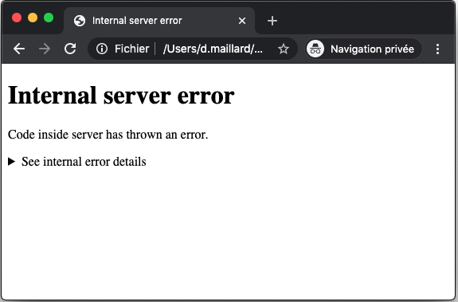
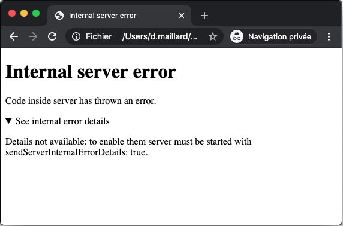
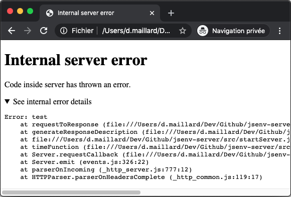

# Handling errors

A route that throws (or rejects) is answered by the first plugin whose `handleError` hook returns a response. **Without such a plugin the error is thrown and the process exits**: a server always runs with one. `serverPluginErrorHandler` is the generic one:

```js
import { serverPluginErrorHandler, startServer } from "@jsenv/server";

await startServer({
  plugins: [serverPluginErrorHandler()],
  routes: [
    {
      endpoint: "GET *",
      fetch: () => {
        throw new Error("toto");
      },
    },
  ],
});
```

It answers 500 with an html page, a text or a json, depending on what the request accepts.





With `sendErrorDetails: true` the error stack (and its properties, in json) is sent. A stack reveals file paths and code: development only.



The error responses get `cache-control: no-store`.

## Handling some errors yourself

`serverPluginErrorHandler` catches every error, so it comes last; a plugin handling a subset of them comes before:

```js
await startServer({
  plugins: [
    {
      handleError: (error) => {
        if (error.code === "FOO") {
          return new Response('Custom response for error with code "FOO"', {
            status: 500,
          });
        }
        return null;
      },
    },
    serverPluginErrorHandler(),
  ],
});
```

An error exposing an `asResponse()` method is answered with what it returns, with or without an error plugin: a way for a domain error to carry its own status (a request body too large is answered 413 that way).

A route can also decide not to throw:

```js
fetch: async () => {
  try {
    return Response.json(await fetchExternalData());
  } catch (error) {
    return Response.json({ error: "Could not retrieve data" }, { status: 502 });
  },
};
```

## Timeouts

A route that has not started responding after `responseTimeout` (10 minutes by default) is answered 504; the route keeps running and what it throws afterwards is logged.

## Stopping on internal error

`stopOnInternalError: true` stops the server once a route throws (after the error handlers answered), for a supervisor to restart it in a clean state.
