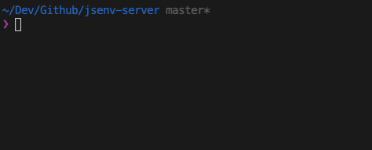

# Server-Sent Events

`ServerEvents` keeps track of the connected clients and broadcasts events to them. A client connects with an `EventSource` (`accept: text/event-stream`) or with a `WebSocket`: `serverEvents.fetch` handles both.

_server.js_

```js
import { ServerEvents, startServer } from "@jsenv/server";

const serverEvents = new ServerEvents();

setInterval(() => {
  serverEvents.sendEventToAllClients({
    type: "ping",
    data: JSON.stringify({ ts: Date.now() }),
  });
}, 1000);

await startServer({
  port: 3456,
  routes: [
    {
      endpoint: "GET /events",
      fetch: serverEvents.fetch,
    },
  ],
});
```

_client.js_

```js
const eventSource = new EventSource("http://localhost:3456/events");
eventSource.addEventListener("ping", (event) => {
  console.log("ping from server", event.lastEventId, JSON.parse(event.data));
});
```



An event is `{ type, data, id, retry }`; `data` is sent as is (stringify objects yourself). Every event gets an incrementing `id` and is kept (`historyLength`, 1000 by default): a client reconnecting with `last-event-id` receives what it missed. A comment is sent every `keepaliveDuration` (30s) so that proxies keep the connection open.

Past `maxClientAllowed` (100) a new client is refused with 503, or the oldest one is disconnected with `actionOnClientLimitReached: "kick-oldest"`. `close()` disconnects everyone and answers 204 until `open()`. `getClientCount()` and `getAllEventSince(id)` tell where things stand.

## Producing events only when someone listens

`LazyServerEvents` runs a producer when the first client connects and its cleanup when the last one leaves — a file watcher, a database subscription, a timer. Only `fetch` is exposed: events can only come from the producer.

```js
import { LazyServerEvents } from "@jsenv/server";

const ticks = new LazyServerEvents(({ sendEvent }) => {
  const interval = setInterval(() => {
    sendEvent({ type: "tick", data: new Date().toISOString() });
  }, 1000);
  return () => {
    clearInterval(interval);
  };
});

// route: { endpoint: "GET /ticks", fetch: ticks.fetch }
```
