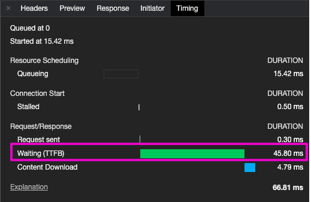
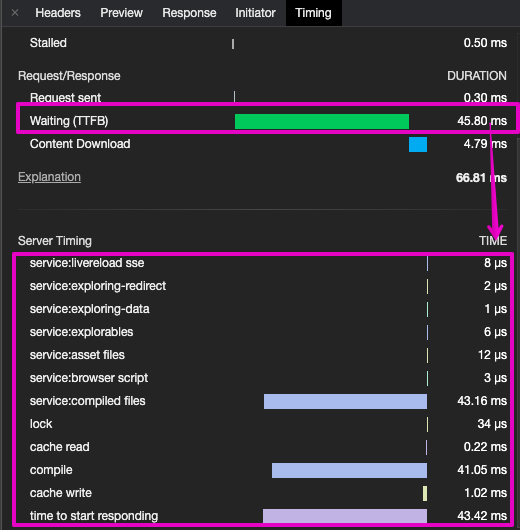

# Server timing

`serverTiming: true` sends a `server-timing` response header telling what the server spent its time on. Devtools show it next to the TTFB of each request.

_Chrome devtools, TTFB:_



_Chrome devtools, server timing:_



```js
import { startServer } from "@jsenv/server";

await startServer({
  serverTiming: true,
  routes: [
    {
      endpoint: "GET *",
      fetch: async (request, { timing }) => {
        const waitTiming = timing("waiting 50ms");
        await new Promise((resolve) => {
          setTimeout(resolve, 50);
        });
        waitTiming.end();
        return new Response("Hello");
      },
    },
  ],
});
```

```console
server-timing: a;desc="time to start responding";dur=51.2, b;desc="routing";dur=0.1, c;desc="waiting 50ms";dur=50.7
```

The header holds:

- `time to start responding`, from the request to the response headers;
- the routing of each group of routes (`routing`, or `<plugin>.routing` for the routes a plugin brought);
- what the route measured with `helpers.timing(name)`; `createFileSystemFetch` measures its stat and etag;
- the `timing` property a plain response object hands back: `{ "db query": 12.3, "served from cache": null }` — a `null` duration is a marker, something to say with nothing to measure.

Entries are named `a`, `b`, `c`… because devtools sort them alphabetically; the `desc` carries the name.

`serverTiming: { minDuration: 0.5 }` drops the entries that took less than that many milliseconds: a request crosses every route, and a wall of sub-millisecond `routing` entries buries the measures worth reading. `time to start responding` and the markers always stay.

## Measuring without telling everyone

The header describes what the server does internally; an api usually wants it for itself, a bench or a probe, and for nobody else. Give a function instead of `true` and it is asked once per request, on what the client sent:

```js
const PERF_TIMING_TOKEN = process.env.PERF_TIMING_TOKEN;
const isPerfTimingClient = (request) =>
  request.headers["x-perf-timing"] === PERF_TIMING_TOKEN;

await startServer({
  serverTiming: isPerfTimingClient,
  plugins: [
    serverPluginCORS({
      accessControlAllowedOrigins: ["https://app.example.com"],
      // without it a page cannot read the timings of a cross-origin response
      timingAllowOrigin: isPerfTimingClient,
    }),
  ],
});
```

`{ enabled: isPerfTimingClient, minDuration: 1 }` says the same thing with a `minDuration`. When the predicate says no nothing is measured for that request and no header is composed; routes still call `helpers.timing(name)` unconditionally, it costs them nothing.
