# [0_basic](../../not_found_by_default.test.mjs#L20)

```js
return run({ cors: false });
```

# 1/2 logs



<details>
  <summary>see without style</summary>

```console
GET http://127.0.0.1/
GET http://127.0.0.1/
  404 The URL / does not exist on this server.
  The list of existing endpoints is available at /.internal/route_inspector.
  404 The URL / does not exist on this server.
  The list of existing endpoints is available at /.internal/route_inspector.
```

</details>


# 2/2 resolve
  <details>
  <summary>details</summary>

```js
{
  "status": 404,
  "headers": {
    "connection": "keep-alive",
    "content-type": "text/html",
    "date": "<X>",
    "keep-alive": "timeout=5",
    "transfer-encoding": "chunked"
  },
  "body": "<!doctype html>\n<html lang=\"en\">\n  <head>\n    <meta charset=\"UTF-8\" />\n    <meta name=\"viewport\" content=\"width=device-width, initial-scale=1.0\" />\n    <title>404 Not Found</title>\n    <style>\n      body {\n        display: flex;\n        min-height: 100vh;\n        margin: 0;\n        align-items: center;\n        justify-content: center;\n        color: #333;\n        font-family: Arial, sans-serif;\n        background-color: #f8f9fa;\n      }\n      .error_container {\n        padding: 20px;\n        text-align: center;\n        background: #fff;\n        border-radius: 8px;\n        box-shadow: 0 4px 6px rgba(0, 0, 0, 0.1);\n      }\n      .error_status {\n        margin: 0;\n        color: #dc3545;\n        font-size: 5rem;\n      }\n      .error_status_text {\n        margin: 10px 0;\n        font-size: 1.5rem;\n        text-align: left;\n        word-break: break-word;\n      }\n      .error_message {\n        color: #555;\n        font-size: 1rem;\n        text-align: left;\n        word-break: break-word;\n      }\n      .home_link {\n        display: inline-block;\n        margin-top: 15px;\n        padding: 10px 15px;\n        color: #fff;\n        text-decoration: none;\n        background-color: #007bff;\n        border-radius: 5px;\n      }\n      .home_link:hover {\n        background-color: #0056b3;\n      }\n    </style>\n  </head>\n  <body>\n    <div class=\"error_container\">\n      <p class=\"error_status\">404</p>\n      <p class=\"error_status_text\">Not Found</p>\n      <p class=\"error_message\">The URL / does not exist on this server.<br />The list of existing endpoints is available at <a href=\"/.internal/route_inspector\">/.internal/route_inspector</a>.</p>\n      <a href=\"/\" jsenv-ignore class=\"home_link\">Return to Home</a>\n    </div>\n    <script src=\"/@jsenv/server/src/services/autoreload_on_server_restart/client/autoreload_on_server_restart.js?inline\"></script>\n  </body>\n</html>\n"
}
```

</details>

---

<sub>
  Generated by <a href="https://github.com/jsenv/core/tree/main/packages/tooling/snapshot">@jsenv/snapshot</a>
</sub>
