# [3_error_with_cors](../../cors.test.mjs#L70)

```js
return run({ cors: true, triggerInternalError: true });
```

# 1/2 logs



<details>
  <summary>see without style</summary>

```console
OPTIONS http://127.0.0.1/
internal error while handling request
--- error stack ---
Error: here
    at redirectRequest (base/cors.test.mjs:28:19)
    at callHook (@jsenv/core/packages/backend/server/src/service_controller.js:62:25)
    at Object.callHooks (@jsenv/core/packages/backend/server/src/service_controller.js:86:27)
    at applyRequestInternalRedirection (@jsenv/core/packages/backend/server/src/start_server.js:399:23)
    at getResponseProperties (@jsenv/core/packages/backend/server/src/start_server.js:532:17)
    at Server.requestEventHandler (@jsenv/core/packages/backend/server/src/start_server.js:698:42)
    at Server.emit (node:events:520:35)
    at parserOnIncoming (node:_http_server:1212:12)
    at HTTPParser.parserOnHeadersComplete (node:_http_common:123:17)
  500 Internal Server Error
```

</details>


# 2/2 resolve

```js
{
  "status": 500,
  "headers": {
    "access-control-allow-headers": "x-requested-with, x-whatever",
    "access-control-allow-methods": "GET",
    "access-control-allow-origin": "http://example.com:80",
    "access-control-max-age": "400",
    "cache-control": "no-store",
    "connection": "keep-alive",
    "content-length": "135",
    "content-type": "text/plain",
    "date": "<X>",
    "keep-alive": "timeout=5",
    "vary": "origin, access-control-request-method, access-control-request-headers"
  },
  "body": "Code inside server has thrown an error:\nDetails not available: to enable them use jsenvServiceErrorHandler({ sendErrorDetails: true })."
}
```

---

<sub>
  Generated by <a href="https://github.com/jsenv/core/tree/main/packages/tooling/snapshot">@jsenv/snapshot</a>
</sub>
