# [0_basic_content_type](../../endpoint_negotiation.test.mjs#L30)

```js
const routes = [
  {
    endpoint: "GET /users",
    availableMediaTypes: ["application/json", "text/plain"],
    fetch: (request, { contentNegotiation }) => {
      if (contentNegotiation.mediaType === "application/json") {
        return Response.json({ data: "Hello" });
      }
      return new Response("Hello");
    },
  },
];
return {
  "GET users without accept header": await run({
    routes,
    method: "GET",
    path: "/users",
    headers: {},
  }),
  "GET users accepting text/css": await run({
    routes,
    method: "GET",
    path: "/users",
    headers: {
      accept: "text/css",
    },
  }),
  "GET users accepting anything": await run({
    routes,
    method: "GET",
    path: "/users",
    headers: {
      accept: "*/*",
    },
  }),
  "GET users accepting json": await run({
    routes,
    method: "GET",
    path: "/users",
    headers: {
      accept: "application/json",
    },
  }),
  "GET users accepting textual responses": await run({
    routes,
    method: "GET",
    path: "/users",
    headers: {
      accept: "text/*",
    },
  }),
};
```

# 1/2 logs



<details>
  <summary>see without style</summary>

```console
GET http://127.0.0.1/users
GET http://127.0.0.1/users
  406 The server cannot produce a response in any of the media types accepted by the request: "text/css".
  Available media types: application/json, text/plain.
  406 The server cannot produce a response in any of the media types accepted by the request: "text/css".
  Available media types: application/json, text/plain.
```

</details>


# 2/2 resolve

```js
{
  "GET users without accept header": {
    "status": 200,
    "headers": {
      "content-type": "application/json",
      "vary": "accept",
      "date": "<X>",
      "connection": "keep-alive",
      "keep-alive": "timeout=5",
      "transfer-encoding": "chunked"
    },
    "body": "{\"data\":\"Hello\"}"
  },
  "GET users accepting text/css": {
    "status": 406,
    "headers": {
      "available-media-types": "application/json, text/plain",
      "vary": "accept",
      "content-type": "application/json",
      "date": "<X>",
      "connection": "keep-alive",
      "keep-alive": "timeout=5",
      "transfer-encoding": "chunked"
    },
    "body": "{\"statusMessage\":\"The server cannot produce a response in any of the media types accepted by the request: \\\"text/css\\\".\\nAvailable media types: application/json, text/plain.\"}"
  },
  "GET users accepting anything": {
    "status": 200,
    "headers": {
      "content-type": "application/json",
      "vary": "accept",
      "date": "<X>",
      "connection": "keep-alive",
      "keep-alive": "timeout=5",
      "transfer-encoding": "chunked"
    },
    "body": "{\"data\":\"Hello\"}"
  },
  "GET users accepting json": {
    "status": 200,
    "headers": {
      "content-type": "application/json",
      "vary": "accept",
      "date": "<X>",
      "connection": "keep-alive",
      "keep-alive": "timeout=5",
      "transfer-encoding": "chunked"
    },
    "body": "{\"data\":\"Hello\"}"
  },
  "GET users accepting textual responses": {
    "status": 200,
    "headers": {
      "content-type": "text/plain;charset=UTF-8",
      "vary": "accept",
      "date": "<X>",
      "connection": "keep-alive",
      "keep-alive": "timeout=5",
      "transfer-encoding": "chunked"
    },
    "body": "Hello"
  }
}
```

---

<sub>
  Generated by <a href="https://github.com/jsenv/core/tree/main/packages/tooling/snapshot">@jsenv/snapshot</a>
</sub>
