# [0_basic](../../http2_push.test.mjs#L99)

```js
return run();
```

# 1/2 logs



<details>
  <summary>see without style</summary>

```console
server started at https://127.0.0.1
server started at https://127.0.0.1
GET https://127.0.0.1/main.html
GET https://127.0.0.1/main.html
  Push /script.js
  Push /script.js
  Push /style.css
  Push /style.css
  200 OK
  200 OK
```

</details>


# 2/2 resolve

```js
{
  "responseBodyAsString": "<!doctype html>\n<html lang=\"en\">\n  <head>\n    <title>Basic website</title>\n    <link rel=\"icon\" href=\"data:,\" />\n  </head>\n\n  <body>\n    <link rel=\"stylesheet\" href=\"./style.css\" />\n    <script type=\"module\" src=\"./script.js\"></script>\n  </body>\n</html>\n",
  "pushedHeaders": [
    {
      ":path": "/script.js",
      ":method": "GET",
      ":authority": "127.0.0.1",
      ":scheme": "https"
    },
    {
      ":path": "/style.css",
      ":method": "GET",
      ":authority": "127.0.0.1",
      ":scheme": "https"
    }
  ]
}
```

---

<sub>
  Generated by <a href="https://github.com/jsenv/core/tree/main/packages/tooling/snapshot">@jsenv/snapshot</a>
</sub>
