# [0_throw_error](../../internal_error.test.mjs#L33)

```js
const error = new Error("message");
error.code = "TEST_CODE";
return run(error);
```

# 1/2 logs



<details>
  <summary>see without style</summary>

```console
GET http://127.0.0.1/
internal error while handling request
--- error stack ---
Error: message
    at base/internal_error.test.mjs:34:19
    at capture (@jsenv/core/packages/tooling/snapshot/src/side_effects/create_capture_side_effects.js:342:29)
    at snapshotTests (@jsenv/core/packages/tooling/snapshot/src/side_effects/snapshot_tests.js:182:33)
  500 Internal Server Error
```

</details>


# 2/2 resolve

```js
{
  "url": "http://127.0.0.1/",
  "status": 500,
  "statusText": "Internal Server Error",
  "headers": {
    "cache-control": "no-store",
    "connection": "keep-alive",
    "content-length": "20",
    "content-type": "application/json",
    "date": "<X>",
    "keep-alive": "timeout=5"
  },
  "body": "{\"code\":\"TEST_CODE\"}"
}
```

---

<sub>
  Generated by <a href="https://github.com/jsenv/core/tree/main/packages/tooling/snapshot">@jsenv/snapshot</a>
</sub>
