# [grantPermissions plugin called once per request](../../permissions.test.mjs)

```js
let callCount = 0;
const server = await startPermissionsServer({
  routes: [
    {
      endpoint: "GET /",
      permissionsRequired: ["admin"],
      permissionsToSee: [],
      fetch: () => new Response("ok"),
    },
  ],
  plugins: [
    {
      name: "test:permissions",
      grantPermissions: () => {
        callCount++;
        return ["user"];
      },
    },
  ],
});
const response = await fetch(server.origin);
return { status: response.status, grantPermissionsCallCount: callCount };
```

# 1/2 logs



<details>
  <summary>see without style</summary>

```console
(node:39642) MaxListenersExceededWarning: Possible EventEmitter memory leak detected. 11 SIGHUP listeners added to [process]. MaxListeners is 10. Use emitter.setMaxListeners() to increase limit
(Use `node --trace-warnings ...` to show where the warning was created)
(node:39642) MaxListenersExceededWarning: Possible EventEmitter memory leak detected. 11 SIGTERM listeners added to [process]. MaxListeners is 10. Use emitter.setMaxListeners() to increase limit
(node:39642) MaxListenersExceededWarning: Possible EventEmitter memory leak detected. 11 SIGINT listeners added to [process]. MaxListeners is 10. Use emitter.setMaxListeners() to increase limit
(node:39642) MaxListenersExceededWarning: Possible EventEmitter memory leak detected. 11 beforeExit listeners added to [process]. MaxListeners is 10. Use emitter.setMaxListeners() to increase limit
(node:39642) MaxListenersExceededWarning: Possible EventEmitter memory leak detected. 11 exit listeners added to [process]. MaxListeners is 10. Use emitter.setMaxListeners() to increase limit
GET http://127.0.0.1/
  403 Forbidden
```

</details>


# 2/2 resolve

```js
{
  "status": 403,
  "grantPermissionsCallCount": 1
}
```

---

<sub>
  Generated by <a href="https://github.com/jsenv/core/tree/main/packages/tooling/snapshot">@jsenv/snapshot</a>
</sub>
