# [access denied with visible permission not satisfied returns 404](../../permissions.test.mjs)

```js
const server = await startPermissionsServer({
  routes: [
    {
      endpoint: "GET /",
      access: "admin",
      visible: "superuser",
      fetch: () => new Response("ok"),
    },
  ],
  plugins: [
    {
      name: "test:permissions",
      getPermissions: () => ["user"],
    },
  ],
});
const response = await fetch(server.origin);
return { status: response.status };
```

# 1/2 logs



<details>
  <summary>see without style</summary>

```console
GET http://127.0.0.1/
  404 The URL / does not exist on this server.
  The list of existing endpoints is available at /.internal/route_inspector.
```

</details>


# 2/2 resolve

```js
{
  "status": 404
}
```

---

<sub>
  Generated by <a href="https://github.com/jsenv/core/tree/main/packages/tooling/snapshot">@jsenv/snapshot</a>
</sub>
