# [array_type](../../state_signal.test.js)

```js
clearSignalRegistry();
const sig = stateSignal([], {
  id: "array_signal",
  type: "array",
});

const initialValue = sig.value;
const initialValid = sig.validity.valid;

// Set to a valid array
sig.value = [1, 2, 3];
const valueAfterSet = sig.value;
const validAfterSet = sig.validity.valid;

// Set to an object — should be invalid
sig.value = { key: "value" };
const validAfterObject = sig.validity.valid;
const typeErrorAfterObject = sig.validity.type;

// Auto-fix from JSON string
sig.value = "[4, 5, 6]";
const validAfterString = sig.validity.valid;
const suggestionAfterString = sig.validity.validSuggestion;

return {
  initialValue,
  initialValid,
  valueAfterSet,
  validAfterSet,
  validAfterObject,
  typeErrorAfterObject,
  validAfterString,
  suggestionAfterString,
};
```

# 1/2 logs



<details>
  <summary>see without style</summary>

```console
[stateSignal:array_signal] validation failed with no valid suggestion:  {
  value: { key: 'value' },
  validity: {
    type: 'must be an array, got object',
    valid: false,
    validSuggestion: null
  }
}
[stateSignal:array_signal] validation failed with no valid suggestion: 
[stateSignal:array_signal] validation failed with no valid suggestion:  {
  value: { key: 'value' },
  validity: {
    type: 'must be an array, got object',
    valid: false,
    validSuggestion: null
  }
}
[stateSignal:array_signal] validation failed with no valid suggestion: 
[stateSignal:array_signal] validation failed with no valid suggestion:  {
  value: { key: 'value' },
  validity: {
    type: 'must be an array, got object',
    valid: false,
    validSuggestion: null
  }
}
[stateSignal:array_signal] validation failed with no valid suggestion: 
```

</details>


# 2/2 return

```js
{
  "initialValue": [],
  "initialValid": true,
  "valueAfterSet": [
    1,
    2,
    3
  ],
  "validAfterSet": true,
  "validAfterObject": false,
  "typeErrorAfterObject": "must be an array, got object",
  "validAfterString": true,
  "suggestionAfterString": null
}
```

---

<sub>
  Generated by <a href="https://github.com/jsenv/core/tree/main/packages/tooling/snapshot">@jsenv/snapshot</a>
</sub>
