# [1_persistence_with_existing_storage](../../state_signal_persists.test.js)

```js
clearAll();

// Pre-populate storage
mockLocalStorage.setItem("existing", "pre_existing_value");

// Create signal - should use stored value
const sig = stateSignal("default", {
  id: "existing",
  persists: true,
});

const valueFromStorage = sig.value;
const defaultWouldBe = "default";

return {
  valueFromStorage,
  defaultWouldBe,
};
```

# 1/2 logs



<details>
  <summary>see without style</summary>

```console
Error decoding localStorage "existing" value: SyntaxError: Unexpected token 'p', "pre_existing_value" is not valid JSON
    at JSON.parse (<anonymous>)
    at Object.decode (base/value_in_local_storage.js:49:45)
    at get (base/value_in_local_storage.js:12:40)
    at getFallbackValue (base/state_signal.js:180:37)
    at stateSignal (base/state_signal.js:250:44)
    at base/state_signal_persists.test.js:77:17
    at capture (@jsenv/core/packages/tooling/snapshot/src/side_effects/create_capture_side_effects.js:342:29)
    at snapshotTests (@jsenv/core/packages/tooling/snapshot/src/side_effects/snapshot_tests.js:183:33)
    at async base/state_signal_persists.test.js:32:1
Error decoding localStorage "existing" value:
```

</details>


# 2/2 return

```js
{
  "valueFromStorage": "default",
  "defaultWouldBe": "default"
}
```

---

<sub>
  Generated by <a href="https://github.com/jsenv/core/tree/main/packages/tooling/snapshot">@jsenv/snapshot</a>
</sub>
