# [1_firefox](../../navi_test.mjs#L64)

```js
run({
  browserLauncher: firefox,
  browserName: "firefox",
})
```

# 1/13 logs



<details>
  <summary>see without style</summary>

```console
GET http://127.0.0.1/favicon.ico
  404 Failed to fetch url content
  @jsenv/core/packages/frontend/navi/src/components/layout/demos/demo_flex.html
  no entry on filesystem
  --- plugin name ---
  "jsenv:file_url_fetching"
```

</details>


# 2/13 write file "./output/demo_flex.html_firefox.png"

see [./output/demo_flex.html_firefox.png](./output/demo_flex.html_firefox.png)

# 3/13 logs


<details>
  <summary>see without style</summary>

```console
GET http://127.0.0.1/favicon.ico
  404 Failed to fetch url content
  @jsenv/core/packages/frontend/navi/src/components/layout/demos/demo_flex.html
  no entry on filesystem
  --- plugin name ---
  "jsenv:file_url_fetching"
```

</details>


# 4/13 write file "./output/demo_layout_buttons.html_firefox.png"

see [./output/demo_layout_buttons.html_firefox.png](./output/demo_layout_buttons.html_firefox.png)

# 5/13 logs


<details>
  <summary>see without style</summary>

```console
GET http://127.0.0.1/favicon.ico
  404 Failed to fetch url content
  @jsenv/core/packages/frontend/navi/src/components/layout/demos/demo_flex.html
  no entry on filesystem
  --- plugin name ---
  "jsenv:file_url_fetching"
```

</details>


# 6/13 write file "./output/demo_badge_count.html_firefox.png"

see [./output/demo_badge_count.html_firefox.png](./output/demo_badge_count.html_firefox.png)

# 7/13 logs


<details>
  <summary>see without style</summary>

```console
GET http://127.0.0.1/favicon.ico
  404 Failed to fetch url content
  @jsenv/core/packages/frontend/navi/src/components/layout/demos/demo_flex.html
  no entry on filesystem
  --- plugin name ---
  "jsenv:file_url_fetching"
```

</details>


# 8/13 write file "./output/demo_icon.html_firefox.png"

see [./output/demo_icon.html_firefox.png](./output/demo_icon.html_firefox.png)

# 9/13 logs


<details>
  <summary>see without style</summary>

```console
GET http://127.0.0.1/favicon.ico
  404 Failed to fetch url content
  @jsenv/core/packages/frontend/navi/src/components/layout/demos/demo_flex.html
  no entry on filesystem
  --- plugin name ---
  "jsenv:file_url_fetching"
```

</details>


# 10/13 write file "./output/demo_text_content_spacing.html_firefox.png"

see [./output/demo_text_content_spacing.html_firefox.png](./output/demo_text_content_spacing.html_firefox.png)

# 11/13 logs


<details>
  <summary>see without style</summary>

```console
GET http://127.0.0.1/favicon.ico
  404 Failed to fetch url content
  @jsenv/core/packages/frontend/navi/src/components/layout/demos/demo_flex.html
  no entry on filesystem
  --- plugin name ---
  "jsenv:file_url_fetching"
```

</details>


# 12/13 write file "./output/demo_text_overflow.html_firefox.png"

see [./output/demo_text_overflow.html_firefox.png](./output/demo_text_overflow.html_firefox.png)

# 13/13 resolve

```js
undefined
```

---

<sub>
  Generated by <a href="https://github.com/jsenv/core/tree/main/packages/tooling/snapshot">@jsenv/snapshot</a>
</sub>
