# assert [](https://www.npmjs.com/package/@jsenv/assert)

_@jsenv/assert_ is the NPM package used by jsenv to write tests.

It can be resumed by the following quote:

> equal() is my favorite assertion. If the only available assertion in every test suite was equal(), almost every test suite in the world would be better for it.
>
> — Eric Elliot in [Rethinking Unit Test Assertion](https://medium.com/javascript-scene/rethinking-unit-test-assertions-55f59358253f)

## Example

```js
import { assert } from "@jsenv/assert";

assert({
  actual: {
    foo: true,
  },
  expect: {
    foo: false,
  },
});
```



## How it works

_assert_ does nothing when comparison is successfull but throws an error when comparison is failing.
To illustrates when a comparison fails, check the list of examples below

_Type failure:_

```js
import { assert } from "@jsenv/assert";

assert({
  actual: 10,
  expect: "10",
});
```



_Prototype failure:_

```js
import { assert } from "@jsenv/assert";

assert({
  actual: new Error(),
  expect: new TypeError(),
});
```



## Usage in Node.js

```console
npm i --save-dev @jsenv/assert
```

```js
import { assert } from "@jsenv/assert";

assert({
  actual: true,
  expect: false,
});
```

## Usage in a browser via CDN

```html
<script type="module">
  import { assert } from "https://unpkg.com/@jsenv/assert@latest/src/main.js";

  assert({
    actual: true,
    expect: false,
  });
</script>
```

## Usage in a browser via NPM

```console
npm i --save-dev @jsenv/assert
```

```html
<script type="module">
  import { assert } from "@jsenv/assert";

  assert({
    actual: true,
    expect: false,
  });
</script>
```
