# assert [](https://www.npmjs.com/package/@jsenv/assert)

_@jsenv/assert_ is the NPM package used by jsenv to write tests.

It can be resumed by the following quote:

> equal() is my favorite assertion. If the only available assertion in every test suite was equal(), almost every test suite in the world would be better for it.
>
> — Eric Elliot in [Rethinking Unit Test Assertion](https://medium.com/javascript-scene/rethinking-unit-test-assertions-55f59358253f)

## Example

```js
import { assert } from "@jsenv/assert";

assert({
  actual: {
    foo: true,
  },
  expect: {
    foo: false,
  },
});
```


There is 200+ examples in [./tests/snapshots/](./tests/snapshots/README.md#Array)

## How it works

_assert_ does nothing when comparison is successfull but throws an error when comparison is failing.

## Features

### Colors

The message produced have colors that helps to see the diff.

- grey: same in actual and expect
- red: found in actual and is different
- green: found in expect and is different
- yellow: found only in actual or found only in expect

### Understand values

Comparison understand all js native values and make the diff more redable

```js
assert({
  actual: 149600000,
  expect: 1464301,
});
```



This includes things like comparison on url parts, date parts, http headers and many more.

### Multiline diff

```js
assert({
  actual: {
    foo: `Hello,
my name is Benjamin
and my brother is joe`,
  },
  expect: {
    foo: `Hello,
my name is Ben
and my brother is joe`,
  },
});
```



### Keep long diff readable

```js
assert({
  actual: "http://example_that_is_quite_long.com/dir/file.txt",
  expect: "http://example_that_is_quite_long.com/dir/file.css",
});
```



### Keep nested diff readable

When the diff is very deep the message omits the parents to keep the message concise and readable

```js
assert({
  actual: {
    the: {
      nesting: {
        is: {
          very: {
            deep: {
              in: {
                this: {
                  one: {
                    foo: {
                      a: true,
                      tata: { test: true, bar: { a: "1" } },
                    },
                  },
                },
              },
            },
          },
        },
      },
    },
  },
  expect: {
    the: {
      nesting: {
        is: {
          very: {
            deep: {
              in: {
                this: {
                  one: {
                    foo: false,
                  },
                },
              },
            },
          },
        },
      },
    },
  },
});
```



### Custom assertions

```js
assert({
  actual: 50,
  expect: assert.between(100, 200),
});
```



### And much more

- Support comparison between value having circular references
- Can detect diff on prototypes
- Can detect diff on object integrity (usage of Object.freeze, Object.seal and Object.preventExtensions)
- Can detect diff on property descriptors
- Can detect diff on property symbols

## Usage in Node.js

```console
npm i --save-dev @jsenv/assert
```

```js
import { assert } from "@jsenv/assert";

assert({
  actual: true,
  expect: false,
});
```

## Usage in a browser

### Using NPM

```console
npm i --save-dev @jsenv/assert
```

```html
<script type="module">
  import { assert } from "@jsenv/assert";

  assert({
    actual: true,
    expect: false,
  });
</script>
```

### Using CDN

```html
<script type="module">
  import { assert } from "https://unpkg.com/@jsenv/assert@latest/src/main.js";

  assert({
    actual: true,
    expect: false,
  });
</script>
```
