# fail_array_too_big

```js
assert({
  actual: [0, 1],
  expected: [0],
});
```



# fail_array_too_small

```js
assert({
  actual: [0],
  expected: [0, 1],
});
```



# fail_string_at_0

```js
assert({
  actual: ["a"],
  expected: ["b"],
});
```


# fail_prototype

```js
assert({
  actual: {},
  expected: [],
});
```



# fail_array_like_length

```js
assert({
  actual: { length: 0 },
  expected: { length: 1 },
});
```



# fail_array_property

```js
constactual = [];
actual.foo = true;
const expected = [];
expected.foo = false;
assert({ actual, expected });
```



# fail_array_symbol

```js
constsymbol = Symbol();
const actual = [];
actual[symbol] = true;
const expected = [];
expected[symbol] = false;
assert({ actual, expected });
```


