# [3 added on fifth pos](../../array.test.js#L190)

```js
assert({
  actual: ["a", "b", "c", "d"],
  expect: ["a", "b", "c", "d", "Z1", "Z2", "Z3"],
});
```



<details>
  <summary>see without style</summary>

```console
AssertionError: actual and expect are different

actual: [
  ↑ 2 values ↑
  "c",
  "d",
]
expect: [
  ↑ 3 values ↑
  "d",
  "Z1",
  "Z2",
  "Z3",
]
```

</details>

---
<sub>
  Generated by <a href="https://github.com/jsenv/core/tree/main/packages/independent/snapshot">@jsenv/snapshot</a>
</sub>