# [object expect, array received](../../array.test.js#L18)

```js
assert({
  actual: [],
  expect: {},
});
```



<details>
  <summary>see without style</summary>

```console
AssertionError: actual and expect are different

actual: []
expect: {}
```

</details>

---

<sub>
  Generated by <a href="https://github.com/jsenv/core/tree/main/packages/independent/snapshot">@jsenv/snapshot</a>
</sub>