# string and array of chars

```js
assert({
  actual: "hello world",
  expect: ["h", "e", "l", "l", "o", " ", "w", "o", "r", "l", "d"],
});
```



<details>
  <summary>see without style</summary>

```console
AssertionError: actual and expect are different

actual: "hello world"
expect: [
  "h",
  "e",
  ↓ 9 values ↓
]
```

</details>


<sub>
  Generated by <a href="https://github.com/jsenv/core/tree/main/packages/independent/snapshot">@jsenv/snapshot</a>
</sub>