# assert_starts_with

<sub>
  Generated by <a href="https://github.com/jsenv/core/tree/main/packages/independent/snapshot">@jsenv/snapshot</a> executing <a href="../assert_starts_with.test.js">../assert_starts_with.test.js</a>
</sub>

## no diff

```js
assert({
  actual: {
    a: "AABB",
    b: true,
  },
  expect: {
    a: assert.startsWith("AAB"),
    b: false,
  },
});
```



<details>
  <summary>see without style</summary>

```console
AssertionError: actual and expect are different

actual: {
  a: "AABB",
  b: true,
}
expect: {
  a: assert.startsWith("AAB"),
  b: false,
}
```

</details>


## does not start with

```js
assert({
  actual: "AABB",
  expect: assert.startsWith("AB"),
});
```


<details>
  <summary>see without style</summary>

```console
AssertionError: actual and expect are different

actual: "AABB"
expect: assert.startsWith("AB")
```

</details>
