# class static property modified

```js
assert({
  actual: class A {
    static a = true;
  },
  expect: class A {
    static a = false;
  },
});
```



<details>
  <summary>see without style</summary>

```console
AssertionError: actual and expect are different

actual: class A {
  [source code];
  static a = true;
}
expect: class A {
  [source code];
  static a = false;
}
```

</details>


<sub>
  Generated by <a href="https://github.com/jsenv/core/tree/main/packages/independent/snapshot">@jsenv/snapshot</a>
</sub>