# map value modified

```js
assert({
  actual: new Map([
    ["a", true], //
  ]),
  expect: new Map([
    ["a", false], //
  ]),
});
```



<details>
  <summary>see without style</summary>

```console
AssertionError: actual and expect are different

actual: Map(
  "a" => true,
)
expect: Map(
  "a" => false,
)
```

</details>


<sub>
  Generated by <a href="https://github.com/jsenv/core/tree/main/packages/independent/snapshot">@jsenv/snapshot</a>
</sub>