# string at 20

```js
assert({
  actual: "abcdefghij",
  expect: "ABCDEFGHIJ",
  MAX_COLUMNS,
});
```



<details>
  <summary>see without style</summary>

```console
AssertionError: actual and expect are different

actual: "abcdefghij"
expect: "ABCDEFGHIJ"
```

</details>


<sub>
  Generated by <a href="https://github.com/jsenv/core/tree/main/packages/independent/snapshot">@jsenv/snapshot</a>
</sub>