# [basic](../../object.test.js#L5)

```js
assert({
  actual: {
    foo: true,
  },
  expect: {
    foo: false,
  },
});
```



<details>
  <summary>see without style</summary>

```console
AssertionError: actual and expect are different

actual: {
  foo: true,
}
expect: {
  foo: false,
}
```

</details>

---
<sub>
  Generated by <a href="https://github.com/jsenv/core/tree/main/packages/independent/snapshot">@jsenv/snapshot</a>
</sub>