# frozen array vs frozen function

```js
assert({
  actual: Object.freeze(["a"]),
  expect: Object.freeze(() => {}),
});
```



<details>
  <summary>see without style</summary>

```console
AssertionError: actual and expect are different

actual: Object.freeze([
  "a",
])
expect: Object.freeze(() => {
  [source code],
})
```

</details>


<sub>
  Generated by <a href="https://github.com/jsenv/core/tree/main/packages/independent/snapshot">@jsenv/snapshot</a>
</sub>