# compare set and map

```js
assert({
  actual: new Map([[0, "a"]]),
  expect: new Set(["a"]),
});
```



<details>
  <summary>see without style</summary>

```console
AssertionError: actual and expect are different

actual: Map(
  0 => "a",
)
expect: Set(
  "a",
)
```

</details>


<sub>
  Generated by <a href="https://github.com/jsenv/core/tree/main/packages/independent/snapshot">@jsenv/snapshot</a>
</sub>