# [blank char should be empty](../../string.test.js#L35)

```js
assert({
  actual: String.fromCharCode(127),
  expect: "",
});
```



<details>
  <summary>see without style</summary>

```console
AssertionError: actual and expect are different

actual: "\x7F"
expect: ""
```

</details>

---

<sub>
  Generated by <a href="https://github.com/jsenv/core/tree/main/packages/independent/snapshot">@jsenv/snapshot</a>
</sub>