# array.md

<sub>
  Generated by <a href="https://github.com/jsenv/core/tree/main/packages/independent/snapshot">@jsenv/snapshot</a> executing <a href="../array.test.js">../array.test.js</a>
</sub>

## array first item diff

```js
assert({
  actual: [true],
  expect: [false],
});
```


## array expect, object received

```js
assert({
  actual: {},
  expect: [],
});
```


## object expect, array received

```js
assert({
  actual: [],
  expect: {},
});
```


## array without diff

```js
assert({
  actual: {
    a: [0],
    z: true,
  },
  expect: {
    a: [0],
    z: false,
  },
});
```


## diff in the middle of big array

```js
assert({
  actual: ["a", "b", "c", "Z", "e", "f", "g", "h"],
  expect: ["a", "b", "c", "d", "e", "f", "g", "h"],
});
```


## big array collapsed because diff is elsewhere

```js
assert({
  actual: {
    a: ["a", "b", "c", "d", "e", "f", "g", "h"],
    b: true,
  },
  expect: {
    a: ["a", "b", "c", "d", "e", "f", "g", "h"],
    b: false,
  },
  MAX_COLUMNS: 35,
});
```


## undefined vs empty

```js
assert({
  actual: [,],
  expect: [undefined],
});
```


## empty added

```js
assert({
  actual: [,],
  expect: [],
});
```


## empty removed

```js
assert({
  actual: [],
  expect: [,],
});
```


## false should be an array

```js
assert({
  actual: false,
  expect: [],
});
```


## associative array expect, object received

```js
assert({
  actual: Object.assign([], {
    foo: true,
  }),
  expect: {
    foo: true,
  },
});
```



## diff on associate array.foo and object.foo

```js
assert({
  actual: Object.assign([], {
    foo: true,
  }),
  expect: {
    foo: false,
  },
});
```


## diff on associate array deep property and object deep property

```js
assert({
  actual: Object.assign([], {
    user: { name: "bob" },
  }),
  expect: {
    user: {
      name: "alice",
    },
  },
});
```


## diff on collapsed array

```js
assert({
  actual: {
    a: {
      same: [true],
      a: [false, false],
      r: [],
      ma: [false, true],
      mr: [false],
      m: [false, false],
    },
  },
  expect: {
    a: {
      same: [true],
      a: [],
      r: [true, true, true],
      ma: [true],
      mr: [true],
      m: [true, true],
    },
  },
  MAX_DEPTH_INSIDE_DIFF: 0,
});
```


## string and array of chars

```js
assert({
  actual: "hello world",
  expect: ["h", "e", "l", "l", "o", " ", "w", "o", "r", "l", "d"],
});
```


## associative array with values

```js
assert({
  actual: Object.assign(["a", "b"], {
    user: "bob",
  }),
  expect: Object.assign(["Z", "b"], {
    user: "alice",
  }),
});
```


## array like and array

```js
assert({
  actual: {
    0: "Z",
    1: "b",
    length: 2,
  },
  expect: [
    "a", //
    "b",
  ],
});
```


## array subclass

```js
class MyArray extends Array {}
assert({
  actual: [true],
  expect: new MyArray(true),
});
```


## added on third pos

```js
assert({
  actual: ["a", "b"],
  expect: ["a", "b", "Z"],
});
```


## added on fifth pos

```js
assert({
  actual: ["a", "b", "c", "d"],
  expect: ["a", "b", "c", "d", "Z"],
});
```



## 2 added on fifth pos

```js
assert({
  actual: ["a", "b", "c", "d"],
  expect: ["a", "b", "c", "d", "Z1", "Z2"],
});
```


## 3 added on fifth pos

```js
assert({
  actual: ["a", "b", "c", "d"],
  expect: ["a", "b", "c", "d", "Z1", "Z2", "Z3"],
});
```


## lot added on fifth pos

```js
assert({
  actual: ["a", "b", "c", "d"],
  expect: ["a", "b", "c", "d", "Z1", "Z2", "Z3", "Z4", "Z5"],
});
```


