# headers.md

<sub>
  Generated by <a href="https://github.com/jsenv/core/tree/main/packages/independent/snapshot">@jsenv/snapshot</a> executing <a href="../headers.test.js">../headers.test.js</a>
</sub>

## content-type added

```js
assert({
  actual: new Headers({
    "content-type": "text/xml",
  }),
  expect: new Headers(),
});
```


## content-type removed

```js
assert({
  actual: new Headers({}),
  expect: new Headers({
    "content-type": "text/xml",
  }),
});
```


## content-type modified

```js
assert({
  actual: new Headers({
    "content-type": "text/css",
  }),
  expect: new Headers({
    "content-type": "text/xml",
  }),
});
```


## content-type multi diff

```js
assert({
  actual: new Headers({
    "content-type": "text/xml, text/css",
  }),
  expect: new Headers({
    "content-type": "text/xml, text/html",
  }),
});
```


## content-type spacing diff

```js
assert({
  actual: new Headers({
    "content-type": "text/xml,text/css",
  }),
  expect: new Headers({
    "content-type": "text/xml, text/css",
  }),
});
```


## set cookie added

```js
assert({
  actual: new Headers({
    "set-cookie": "a=1",
  }),
  expect: new Headers({}),
});
```


## set cookie removed

```js
assert({
  actual: new Headers({}),
  expect: new Headers({
    "set-cookie": "a=1;",
  }),
});
```


## cookie added

```js
assert({
  actual: new Headers({
    "set-cookie": "a=1,b=2",
  }),
  expect: new Headers({
    "set-cookie": "a=1",
  }),
});
```


## cookie removed

```js
assert({
  actual: new Headers({
    "set-cookie": "a=1",
  }),
  expect: new Headers({
    "set-cookie": "a=1,b=2,",
  }),
});
```


## cookie order modified

```js
assert({
  actual: new Headers({
    "set-cookie": "a=1,b=2",
  }),
  expect: new Headers({
    "set-cookie": "b=2,a=1",
  }),
});
```



## cookie name used several times

```js
assert({
  actual: new Headers({
    "set-cookie": "a=1,a=2",
  }),
  expect: new Headers({
    "set-cookie": "a=9,a=8",
  }),
});
```


## cookie becomes secure

```js
assert({
  actual: new Headers({
    "set-cookie": "a=1; Secure",
  }),
  expect: new Headers({
    "set-cookie": "a=1",
  }),
});
```


## accept

```js
assert({
  actual: new Headers({
    accept: "text/html, application/xml;q=0.9, */*;q=0.8",
  }),
  expect: new Headers({
    accept: "text/html, application/xml;q=0.8, */*;q=0.7, text/css",
  }),
});
```


## accept diff on non standard attribute

```js
assert({
  actual: new Headers({
    accept: "text/html; a=1; b=2",
  }),
  expect: new Headers({
    accept: "text/html; a=9; b=9",
  }),
});
```


## add accepted encoding

```js
assert({
  actual: new Headers({
    "accept-encoding": "deflate, gzip, br",
  }),
  expect: new Headers({
    "accept-encoding": "deflate, gzip",
  }),
});
```


## remove accepted encoding

```js
assert({
  actual: new Headers({
    "accept-encoding": "deflate, gzip",
  }),
  expect: new Headers({
    "accept-encoding": "deflate, gzip, br",
  }),
});
```


## accept-encoding diff on q

```js
assert({
  actual: new Headers({
    "accept-encoding": "deflate, gzip;q=1.0, *;q=0.5",
  }),
  expect: new Headers({
    "accept-encoding": "deflate, gzip;q=0.9, *;q=0.4",
  }),
});
```


## accept-language

```js
assert({
  actual: new Headers({
    "accept-language": "fr-CH, fr;q=0.9, en;q=0.8, de;q=0.7, *;q=0.5",
  }),
  expect: new Headers({
    "accept-language": "en-US,en;q=0.5",
  }),
});
```


## add metric in server timing

```js
assert({
  actual: new Headers({
    "server-timing": `cpu;dur=2.4, app;dur=47.2`,
  }),
  expect: new Headers({
    "server-timing": `cpu;dur=2.4`,
  }),
});
```


## remove metric in server timing

```js
assert({
  actual: new Headers({
    "server-timing": `cpu;dur=2.4`,
  }),
  expect: new Headers({
    "server-timing": `cpu;dur=2.4, app;dur=47.2`,
  }),
});
```


## add description to a metric

```js
assert({
  actual: new Headers({
    "server-timing": `cache;dur=23.2`,
  }),
  expect: new Headers({
    "server-timing": `cache;desc="Cache Read";dur=23.2`,
  }),
});
```


## content length diff

```js
assert({
  actual: new Headers({
    "content-length": "1456",
  }),
  expect: new Headers({
    "content-length": "1356",
  }),
});
```

