# impenetrables.md

<sub>
  Generated by <a href="https://github.com/jsenv/core/tree/main/packages/independent/snapshot">@jsenv/snapshot</a> executing <a href="../impenetrables.test.js">../impenetrables.test.js</a>
</sub>

## promise

```js
assert({
  actual: {
    a: true,
    b: Promise.resolve(40),
  },
  expect: {
    a: false,
    b: Promise.resolve(42),
  },
});
```



## weakset

```js
assert({
  actual: {
    a: true,
    b: new WeakSet([{}, [], Symbol.iterator]),
  },
  expect: {
    a: false,
    b: new WeakSet([Symbol.iterator]),
  },
});
```



## weakmap

```js
assert({
  actual: {
    a: true,
    b: new WeakMap([
      [{}, "object"],
      [[], "array"],
      [Symbol.iterator, { yes: true }],
    ]),
  },
  expect: {
    a: false,
    b: new WeakMap([[{}, "toto"]]),
  },
});
```

