# object_integrity.md

<sub>
  Generated by <a href="https://github.com/jsenv/core/tree/main/packages/independent/snapshot">@jsenv/snapshot</a> executing <a href="../object_integrity.test.js">../object_integrity.test.js</a>
</sub>

## frozen vs not frozen

```js
assert({
  actual: Object.freeze({ a: true }),
  expect: { a: true },
});
```


## not frozen vs frozen

```js
assert({
  actual: { a: true },
  expect: Object.freeze({ a: true }),
});
```


## sealed vs not sealed

```js
assert({
  actual: Object.seal({ a: true }),
  expect: { a: true },
});
```


## not sealed vs sealed

```js
assert({
  actual: { a: true },
  expect: Object.seal({ a: true }),
});
```


## frozen vs sealed

```js
assert({
  actual: Object.freeze({ a: true }),
  expect: Object.seal({ a: true }),
});
```


## sealed vs frozen

```js
assert({
  actual: Object.seal({ a: true }),
  expect: Object.freeze({ a: true }),
});
```


## extensible vs non extensible

```js
assert({
  actual: { a: true },
  expect: Object.preventExtensions({ a: true }),
});
```


## non extensible vs extensible

```js
assert({
  actual: Object.preventExtensions({ a: true }),
  expect: { a: true },
});
```


## sealed vs non extensible

```js
assert({
  actual: Object.seal({ a: true }),
  expect: Object.preventExtensions({ a: true }),
});
```



## non extensible vs frozen

```js
assert({
  actual: Object.preventExtensions({ a: true }),
  expect: Object.freeze({ a: true }),
});
```


## frozen array vs frozen function

```js
assert({
  actual: Object.freeze(["a"]),
  expect: Object.freeze(() => {}),
});
```


## both sealed, diff is elsewhere

```js
assert({
  actual: {
    a: Object.freeze({ a: true }),
    b: true,
  },
  expect: {
    a: Object.freeze({ a: true }),
    b: false,
  },
});
```

