# assert_any.md

<sub>
  Generated by <a href="https://github.com/jsenv/core/tree/main/packages/independent/snapshot">@jsenv/snapshot</a> executing <a href="../assert_any.test.js">../assert_any.test.js</a>
</sub>

## 10 and any(String)

```js
assert({
  actual: 10,
  expect: assert.any(String),
});
```

_throw.svg)

## "foo" and any(String)

```js
assert({
  actual: {
    a: true,
    b: "foo",
  },
  expect: {
    a: false,
    b: assert.any(String),
  },
});
```

_throw.svg)

## "foo" and not(any(String))

```js
assert({
  actual: "foo",
  expect: assert.not(assert.any(String)),
});
```

)_throw.svg)

## 10 is any Number

```js
assert({
  actual: {
    a: 10,
    b: true,
  },
  expect: {
    a: assert.any(Number),
    b: false,
  },
});
```


## 0 is any number

```js
assert({
  actual: {
    a: 0,
    b: true,
  },
  expect: {
    a: assert.any(Number),
    b: false,
  },
});
```



## any Error

```js
assert({
  actual: {
    a: new Error(),
    b: true,
  },
  expect: {
    a: assert.any(Error),
    b: false,
  },
});
```

