# assert_between.md

<sub>
  Generated by <a href="https://github.com/jsenv/core/tree/main/packages/independent/snapshot">@jsenv/snapshot</a> executing <a href="../assert_between.test.js">../assert_between.test.js</a>
</sub>

## below or equals

```js
assert({
  actual: 50,
  expect: assert.belowOrEquals(25),
});
```


<details>
  <summary>see without style</summary>

```console
AssertionError: actual and expect are different

actual: 50
expect: assert.belowOrEquals(25)
```

</details>


## below or equals when removed

```js
assert({
  actual: {},
  expect: {
    a: assert.belowOrEquals(25),
  },
});
```


<details>
  <summary>see without style</summary>

```console
AssertionError: actual and expect are different

actual: {}
expect: {
  a: assert.belowOrEquals(25),
}
```

</details>


## below or equals ok

```js
assert({
  actual: {
    a: true,
    b: 25,
  },
  expect: {
    a: false,
    b: assert.belowOrEquals(25),
  },
});
```



<details>
  <summary>see without style</summary>

```console
AssertionError: actual and expect are different

actual: {
  a: true,
  b: 25,
}
expect: {
  a: false,
  b: assert.belowOrEquals(25),
}
```

</details>


## 50 is too small

```js
assert({
  actual: 50,
  expect: assert.between(100, 200),
});
```


<details>
  <summary>see without style</summary>

```console
AssertionError: actual and expect are different

actual: 50
expect: assert.between(100, 200)
```

</details>


## 3500 is between 3000 and 5000

```js
assert({
  actual: {
    a: 3_500,
    b: true,
  },
  expect: {
    a: assert.between(3_000, 5_000),
    b: false,
  },
});
```


<details>
  <summary>see without style</summary>

```console
AssertionError: actual and expect are different

actual: {
  a: 3_500,
  b: true,
}
expect: {
  a: assert.between(3_000, 5_000),
  b: false,
}
```

</details>
