# boolean.md

<sub>
  Generated by <a href="https://github.com/jsenv/core/tree/main/packages/independent/snapshot">@jsenv/snapshot</a> executing <a href="../boolean.test.js">../boolean.test.js</a>
</sub>

## true should be false

```js
assert({
  actual: true,
  expect: false,
});
```

```console
AssertionError: actual and expect are different

actual: true
expect: false
```

<details>
  <summary>see colored</summary>

  

</details>


## false should be true

```js
assert({
  actual: false,
  expect: true,
});
```

```console
AssertionError: actual and expect are different

actual: false
expect: true
```

<details>
  <summary>see colored</summary>

  

</details>


## true should be 1

```js
assert({
  actual: true,
  expect: 1,
});
```

```console
AssertionError: actual and expect are different

actual: true
expect: 1
```

<details>
  <summary>see colored</summary>

  

</details>


## false should be 0

```js
assert({
  actual: false,
  expect: 0,
});
```

```console
AssertionError: actual and expect are different

actual: false
expect: 0
```

<details>
  <summary>see colored</summary>

  

</details>
