# error.md

<sub>
  Generated by <a href="https://github.com/jsenv/core/tree/main/packages/independent/snapshot">@jsenv/snapshot</a> executing <a href="../error.test.js">../error.test.js</a>
</sub>

## error message added

```js
assert({
  actual: new Error("foo"),
  expect: new Error(),
});
```

```console
AssertionError: actual and expect are different

actual: Error: foo
expect: Error
```

<details>
  <summary>see colored</summary>

  

</details>


## error message removed

```js
assert({
  actual: new Error(),
  expect: new Error("bar"),
});
```

```console
AssertionError: actual and expect are different

actual: Error
expect: Error: bar
```

<details>
  <summary>see colored</summary>

  

</details>


## error message modified

```js
assert({
  actual: new Error("foo"),
  expect: new Error("bar"),
});
```

```console
AssertionError: actual and expect are different

actual: Error: foo
expect: Error: bar
```

<details>
  <summary>see colored</summary>

  

</details>


## error message vs object with message

```js
assert({
  actual: new Error("foo"),
  expect: { message: "foo" },
});
```

```console
AssertionError: actual and expect are different

actual: Error: foo
expect: {
  message: "foo",
}
```

<details>
  <summary>see colored</summary>

  

</details>


## error stack vs object with stack

```js
assert({
  actual: new Error("message"),
  expect: { stack: "stack" },
});
```

```console
AssertionError: actual and expect are different

actual: Error: message
expect: {
  stack: "stack",
}
```

<details>
  <summary>see colored</summary>

  

</details>


## error message multiline

```js
assert({
  actual: new Error(`Hello
world`),
  expect: new Error(`Hello
france`),
});
```

```console
AssertionError: actual and expect are different

actual: Error: Hello
world
expect: Error: Hello
france
```

<details>
  <summary>see colored</summary>

  

</details>


## error prop added

```js
assert({
  actual: Object.assign(new Error("message"), { a: true }),
  expect: new Error("message"),
});
```

```console
AssertionError: actual and expect are different

actual: Error: message {
  a: true,
}
expect: Error: message
```

<details>
  <summary>see colored</summary>

  

</details>


## error prop removed

```js
assert({
  actual: new Error("message"),
  expect: Object.assign(new Error("message"), { a: true }),
});
```

```console
AssertionError: actual and expect are different

actual: Error: message
expect: Error: message {
  a: true,
}
```

<details>
  <summary>see colored</summary>

  

</details>


## error prop modified

```js
assert({
  actual: Object.assign(new Error("message"), { a: true }),
  expect: Object.assign(new Error("message"), { a: false }),
});
```

```console
AssertionError: actual and expect are different

actual: Error: message {
  a: true,
}
expect: Error: message {
  a: false,
}
```

<details>
  <summary>see colored</summary>

  

</details>


## error vs typeError

```js
assert({
  actual: new Error(),
  expect: new TypeError(),
});
```

```console
AssertionError: actual and expect are different

actual: Error
expect: TypeError
```

<details>
  <summary>see colored</summary>

  

</details>


## error vs CustomError

```js
class ValidationError extends Error {}
assert({
  actual: new Error(),
  expect: new ValidationError(),
});
```

```console
AssertionError: actual and expect are different

actual: Error
expect: ValidationError
```

<details>
  <summary>see colored</summary>

  

</details>


## actual message multiline, expect single

```js
assert({
  actual: new Error(`snapshot comparison
b
file:///Users/damien.maillard/dev/perso/jsenv-core/packages/related/test/tests/test_plan_execution/snapshot_comparison/node_client/my_snapshots/file.txt`),
  expect: new Error(`snapshot comparison`),
});
```

```console
AssertionError: actual and expect are different

actual: Error: snapshot comparison
b
@jsenv/core/packages/related/test/tests/test_plan_execution/…
expect: Error: snapshot comparison
```

<details>
  <summary>see colored</summary>

  

</details>
