# fetch.md

<sub>
  Generated by <a href="https://github.com/jsenv/core/tree/main/packages/independent/snapshot">@jsenv/snapshot</a> executing <a href="../fetch.test.js">../fetch.test.js</a>
</sub>

## abort signal pending vs aborted

```js
const expectAbortController = new AbortController();
expectAbortController.abort("toto");
assert({
  actual: new AbortController().signal,
  expect: expectAbortController.signal,
});
```


<details>
  <summary>see without style</summary>

```console
AssertionError: actual and expect are different

actual: AbortSignal
expect: AbortSignal {
  aborted: true,
  reason: "toto",
}
```

</details>


## request url diff

```js
assert({
  actual: new Request("https://foo.com"),
  expect: new Request("https://bar.com"),
});
```


<details>
  <summary>see without style</summary>

```console
AssertionError: actual and expect are different

actual: Request("https://foo.com/")
expect: Request("https://bar.com/")
```

</details>


## request with custom options

```js
assert({
  actual: new Request("http://example.com", {
    cache: "default",
    credentials: "same-origin",
    destination: "",
    method: "GET",
    mode: "cors",
    priority: "auto",
    redirect: "follow",
    referrerPolicy: "",
    referrer: "about:client",
  }),
  expect: new Request("http://example.com", {
    body: '{"foo": "bar"}',
    cache: "no-store",
    credentials: "omit",
    destination: "document",
    headers: { from: "developer@example.org" },
    method: "POST",
    mode: "same-origin",
    priority: "high",
    redirect: "manual",
    referrerPolicy: "strict-origin",
    referrer: "http://google.com",
  }),
  MAX_CONTEXT_AFTER_DIFF: 10,
  MAX_CONTEXT_BEFORE_DIFF: 10,
  MAX_DEPTH_INSIDE_DIFF: 5,
});
```


<details>
  <summary>see without style</summary>

```console
AssertionError: actual and expect are different

actual: Request("http://example.com/")
expect: Request("http://example.com/", {
  body: ReadableStream,
  cache: "no-store",
  credentials: "omit",
  headers: Headers(
    "from" => "developer@example.org",
  ),
  method: "POST",
  mode: "same-origin",
  redirect: "manual",
  referrerPolicy: "strict-origin",
  referrer: "http://google.com/",
})
```

</details>


## request abort signal pending vs aborted

```js
const expectAbortController = new AbortController();
expectAbortController.abort("toto");
assert({
  actual: new Request("http://example.com", {
    signal: new AbortController().signal,
  }),
  expect: new Request("http://example.com", {
    signal: expectAbortController.signal,
  }),
});
```


<details>
  <summary>see without style</summary>

```console
AssertionError: actual and expect are different

actual: Request("http://example.com/")
expect: Request("http://example.com/", {
  signal: AbortSignal {
    aborted: true,
    reason: "toto",
  },
})
```

</details>


## response body diff

```js
assert({
  actual: {
    a: new Response("foo"),
    b: true,
  },
  expect: {
    a: new Response("bar"),
    b: false,
  },
});
```



<details>
  <summary>see without style</summary>

```console
AssertionError: actual and expect are different

actual: {
  a: Response(ReadableStream, { status: 200 }),
  b: true,
}
expect: {
  a: Response(ReadableStream, { status: 200 }),
  b: false,
}
```

</details>


## response status diff

```js
assert({
  actual: new Response("", {
    status: 200,
  }),
  expect: new Response("", {
    status: 400,
  }),
});
```


<details>
  <summary>see without style</summary>

```console
AssertionError: actual and expect are different

actual: Response(ReadableStream, {
  status: 200,
})
expect: Response(ReadableStream, {
  status: 400,
})
```

</details>


## response prop diff

```js
assert({
  actual: new Response("", {
    status: 200,
    statusText: "",
    type: "basic",
  }),
  expect: new Response("", {
    status: 400,
    statusText: "Bad request",
    headers: {
      "content-length": "0",
    },
    type: "opaque",
  }),
  MAX_CONTEXT_BEFORE_DIFF: 8,
  MAX_CONTEXT_AFTER_DIFF: 8,
});
```


<details>
  <summary>see without style</summary>

```console
AssertionError: actual and expect are different

actual: Response(ReadableStream, {
  headers: Headers(
    "content-type" => "text/plain;charset=UTF-8",
  ),
  status: 200,
})
expect: Response(ReadableStream, {
  headers: Headers(
    "content-length" => "0"
  ),
  status: 400,
  statusText: "Bad request",
})
```

</details>


## redirected response

```js
assert({
  actual: new Response("", { status: 200 }),
  expect: Response.redirect("http://example.com"),
});
```


<details>
  <summary>see without style</summary>

```console
AssertionError: actual and expect are different

actual: Response(ReadableStream, {
  headers: Headers(
    "content-type" => "text/plain;charset=UTF-8",
  ),
  status: 200,
})
expect: Response(null, {
  headers: Headers(
    "location" => "http://example.com/",
  ),
  status: 302,
})
```

</details>
