# function.md

<sub>
  Generated by <a href="https://github.com/jsenv/core/tree/main/packages/independent/snapshot">@jsenv/snapshot</a> executing <a href="../function.test.js">../function.test.js</a>
</sub>

## async arrow function vs arrow function

```js
const anonymousAsyncArrowFunction = (function () {
  return async () => {};
})();
const anonymousArrowFunction = (function () {
  return () => {};
})();
assert({
  actual: anonymousAsyncArrowFunction,
  expect: anonymousArrowFunction,
});
```

```console
AssertionError: actual and expect are different

actual: async () => { [source code] }
expect: () => { [source code] }
```

<details>
  <summary>see colored</summary>

  

</details>


## arrow function source modified, name same

```js
const anonymousArrowReturningTrue = (function () {
  return () => true;
})();
const anonymousArrowReturningFalse = (function () {
  return () => false;
})();
assert({
  actual: anonymousArrowReturningTrue,
  expect: anonymousArrowReturningFalse,
});
```

```console
AssertionError: actual and expect are different

actual: () => {
  [source code],
}
expect: () => {
  [source code],
}
```

<details>
  <summary>see colored</summary>

  

</details>


## async function vs function

```js
const anonymousAsyncFunction = (function () {
  return async function () {};
})();
const anonymousFunction = (function () {
  return function () {};
})();
assert({
  actual: anonymousAsyncFunction,
  expect: anonymousFunction,
});
```

```console
AssertionError: actual and expect are different

actual: async function () { [source code] }
expect: function () { [source code] }
```

<details>
  <summary>see colored</summary>

  

</details>


## function vs arrow function

```js
const anonymousFunction = (function () {
  return function () {};
})();
const anonymousArrowFunction = (function () {
  return () => {};
})();
assert({
  actual: anonymousFunction,
  expect: anonymousArrowFunction,
});
```

```console
AssertionError: actual and expect are different

actual: function () {
  [source code],
}
expect: () => {
  [source code],
}
```

<details>
  <summary>see colored</summary>

  

</details>


## function source modified, name same

```js
const anonymousFunctionReturningTrue = (function () {
  return function () {
    return true;
  };
})();
const anonymousFunctionReturningFalse = (function () {
  return function () {
    return false;
  };
})();
assert({
  actual: anonymousFunctionReturningTrue,
  expect: anonymousFunctionReturningFalse,
});
```

```console
AssertionError: actual and expect are different

actual: function () {
  [source code],
}
expect: function () {
  [source code],
}
```

<details>
  <summary>see colored</summary>

  

</details>


## function source same, name modified

```js
assert({
  actual: function foo() {},
  expect: function bar() {},
});
```

```console
AssertionError: actual and expect are different

actual: function foo () { [source code] }
expect: function bar () { [source code] }
```

<details>
  <summary>see colored</summary>

  

</details>


## anonymous function vs named function

```js
const anonymousFunction = (function () {
  return function () {};
})();
function foo() {}
assert({
  actual: anonymousFunction,
  expect: foo,
});
```

```console
AssertionError: actual and expect are different

actual: function () { [source code] }
expect: function foo () { [source code] }
```

<details>
  <summary>see colored</summary>

  

</details>


## number of diff when comparing async function and function

```js
const anonymousAsyncFunction = (function () {
  return async function () {};
})();
const anonymousFunction = (function () {
  return function () {};
})();
assert({
  actual: {
    a: anonymousAsyncFunction,
    b: true,
  },
  expect: {
    a: anonymousFunction,
    b: false,
  },
});
```

```console
AssertionError: actual and expect are different

actual: {
  a: async function () { [source code] },
  b: true,
}
expect: {
  a: function () { [source code] },
  b: false,
}
```

<details>
  <summary>see colored</summary>

  

</details>


## function prototype modified

```js
function Foo() {}
Foo.prototype.a = true;
Foo.prototype.b = false;
function Bar() {}
Bar.prototype.a = true;
Bar.prototype.b = true;
assert({
  actual: Foo,
  expect: Bar,
});
```

```console
AssertionError: actual and expect are different

actual: function Foo () {
  [source code],
  prototype: {
    a: true,
    b: false,
  },
}
expect: function Bar () {
  [source code],
  prototype: {
    a: true,
    b: true,
  },
}
```

<details>
  <summary>see colored</summary>

  

</details>


## function prototype added

```js
function Foo() {}
function Bar() {}
Bar.prototype.a = true;
assert({
  actual: Foo,
  expect: Bar,
});
```

```console
AssertionError: actual and expect are different

actual: function Foo () {
  [source code],
}
expect: function Bar () {
  [source code],
  prototype: {
    a: true,
  },
}
```

<details>
  <summary>see colored</summary>

  

</details>


## class vs function

```js
assert({
  actual: class {},
  expect: function () {},
});
```

```console
AssertionError: actual and expect are different

actual: class actual {
  [source code];
}
expect: function expect () {
  [source code],
}
```

<details>
  <summary>see colored</summary>

  

</details>


## class Animal vs class Robot

```js
assert({
  actual: class Animal {},
  expect: class Robot {},
});
```

```console
AssertionError: actual and expect are different

actual: class Animal { [source code] }
expect: class Robot { [source code] }
```

<details>
  <summary>see colored</summary>

  

</details>


## extends Animal vs extend Robot

```js
class Animal {
  static type = "animal";
}
class Robot {
  static type = "robot";
}
assert({
  actual: class Human extends Animal {
    static type = "human_actual";
  },
  expect: class Human extends Robot {
    static type = "human_expected";
  },
});
```

```console
AssertionError: actual and expect are different

actual: class Human extends Animal {
  [source code];
  static type = "human_actual";
}
expect: class Human extends Robot {
  [source code];
  static type = "human_expected";
}
```

<details>
  <summary>see colored</summary>

  

</details>


## class static property modified

```js
assert({
  actual: class A {
    static a = true;
  },
  expect: class A {
    static a = false;
  },
});
```

```console
AssertionError: actual and expect are different

actual: class A {
  [source code];
  static a = true;
}
expect: class A {
  [source code];
  static a = false;
}
```

<details>
  <summary>see colored</summary>

  

</details>


## class static property added

```js
assert({
  actual: class A {
    static a = true;
  },
  expect: class A {},
});
```

```console
AssertionError: actual and expect are different

actual: class A {
  [source code];
  static a = true;
}
expect: class A {
  [source code];
}
```

<details>
  <summary>see colored</summary>

  

</details>


## class static property removed

```js
assert({
  actual: class A {},
  expect: class A {
    static a = false;
  },
});
```

```console
AssertionError: actual and expect are different

actual: class A {
  [source code];
}
expect: class A {
  [source code];
  static a = false;
}
```

<details>
  <summary>see colored</summary>

  

</details>


## class method diff source

```js
const anonymousActualClass = (function () {
  return class {
    a() {
      return true;
    }
  };
})();
const anonymousExpectClass = (function () {
  return class {
    a() {
      return false;
    }
  };
})();
assert({
  actual: anonymousActualClass,
  expect: anonymousExpectClass,
});
```

```console
AssertionError: actual and expect are different

actual: class {
  [source code];
  a() {
    [source code],
  };
}
expect: class {
  [source code];
  a() {
    [source code],
  };
}
```

<details>
  <summary>see colored</summary>

  

</details>


## class method added

```js
assert({
  actual: class A {
    a() {}
  },
  expect: class A {},
});
```

```console
AssertionError: actual and expect are different

actual: class A {
  [source code];
  a() {
    [source code],
  };
}
expect: class A {
  [source code];
}
```

<details>
  <summary>see colored</summary>

  

</details>


## class method removed

```js
assert({
  actual: class A {},
  expect: class A {
    a() {}
  },
});
```

```console
AssertionError: actual and expect are different

actual: class A {
  [source code];
}
expect: class A {
  [source code];
  a() {
    [source code],
  };
}
```

<details>
  <summary>see colored</summary>

  

</details>


## class constructor modified

```js
assert({
  actual: class {
    constructor() {
      console.log("actual");
    }
  },
  expect: class {
    constructor() {
      console.log("expect");
    }
  },
});
```

```console
AssertionError: actual and expect are different

actual: class actual {
  [source code];
}
expect: class expect {
  [source code];
}
```

<details>
  <summary>see colored</summary>

  

</details>


## arrow function source same, name modified

```js
const foo = () => {};
const bar = () => {};
assert({
  actual: {
    a: foo,
    b: true,
  },
  expect: {
    a: bar,
    b: false,
  },
});
```

```console
AssertionError: actual and expect are different

actual: {
  a: () => { [source code] },
  b: true,
}
expect: {
  a: () => { [source code] },
  b: false,
}
```

<details>
  <summary>see colored</summary>

  

</details>


## arrow function source same, name same

```js
const fn = () => {};
assert({
  actual: {
    a: fn,
    b: true,
  },
  expect: {
    a: fn,
    b: false,
  },
});
```

```console
AssertionError: actual and expect are different

actual: {
  a: () => { [source code] },
  b: true,
}
expect: {
  a: () => { [source code] },
  b: false,
}
```

<details>
  <summary>see colored</summary>

  

</details>


## class constructor added

```js
assert({
  actual: class {
    constructor() {
      console.log("actual");
    }
  },
  expect: class {},
});
```

```console
AssertionError: actual and expect are different

actual: class actual {
  [source code];
}
expect: class expect {
  [source code];
}
```

<details>
  <summary>see colored</summary>

  

</details>


## class constructor removed

```js
assert({
  actual: class {},
  expect: class {
    constructor() {
      console.log("expect");
    }
  },
});
```

```console
AssertionError: actual and expect are different

actual: class actual {
  [source code];
}
expect: class expect {
  [source code];
}
```

<details>
  <summary>see colored</summary>

  

</details>


## static property value modified

```js
const anonymousActualClass = (function () {
  return class {
    a = "a_prop"; // class properties cannot be listed so it won't be catched
    static a = "a_static";
  };
})();
const anonymousExpectClass = (function () {
  return class {
    a = "a_prop_2";
    static a = "a_static_2";
  };
})();
assert({
  actual: anonymousActualClass,
  expect: anonymousExpectClass,
});
```

```console
AssertionError: actual and expect are different

actual: class {
  [source code];
  static a = "a_static";
}
expect: class {
  [source code];
  static a = "a_static_2";
}
```

<details>
  <summary>see colored</summary>

  

</details>


## static method return value modified

```js
const anonymousActualClass = (function () {
  return class {
    static a() {
      return true;
    }
  };
})();
const anonymousExpectClass = (function () {
  return class {
    static a() {
      return false;
    }
  };
})();
assert({
  actual: anonymousActualClass,
  expect: anonymousExpectClass,
});
```

```console
AssertionError: actual and expect are different

actual: class {
  [source code];
  a() {
    [source code],
  };
}
expect: class {
  [source code];
  a() {
    [source code],
  };
}
```

<details>
  <summary>see colored</summary>

  

</details>


## class static property and object property

```js
assert({
  actual: class {
    static a = true;
    static b = true;
  },
  expect: {
    a: true,
    b: false,
  },
});
```

```console
AssertionError: actual and expect are different

actual: class actual {
  [source code];
  static a = true;
  static b = true;
}
expect: {
  a: true,
  b: false,
}
```

<details>
  <summary>see colored</summary>

  

</details>


## class static prop and function prop

```js
assert({
  actual: class {
    static a = true;
  },
  expect: Object.assign(function () {}, {
    a: true,
  }),
});
```

```console
AssertionError: actual and expect are different

actual: class actual {
  [source code];
  static a = true;
}
expect: function () {
  [source code],
  a: true,
}
```

<details>
  <summary>see colored</summary>

  

</details>


## class prototype method vs function prototype method

```js
const toto = function () {};
toto.a = true;
toto.prototype.b = () => {};
assert({
  actual: class {
    static a = true;
    b() {}
  },
  expect: toto,
});
```

```console
AssertionError: actual and expect are different

actual: class actual {
  [source code];
  b() {
    [source code],
  };
  static a = true;
}
expect: function toto () {
  [source code],
  prototype: {
    b: () => {
      [source code],
    },
  },
  a: true,
}
```

<details>
  <summary>see colored</summary>

  

</details>


## class constructor vs function

```js
assert({
  actual: class {
    constructor() {
      console.log("actual");
    }
  },
  expect: function () {
    console.log("expect");
  },
});
```

```console
AssertionError: actual and expect are different

actual: class actual {
  [source code];
}
expect: function expect () {
  [source code],
}
```

<details>
  <summary>see colored</summary>

  

</details>
