# max_columns.md

<sub>
  Generated by <a href="https://github.com/jsenv/core/tree/main/packages/independent/snapshot">@jsenv/snapshot</a> executing <a href="../max_columns.test.js">../max_columns.test.js</a>
</sub>

## at removed char

```js
assert({
  actual: "str",
  expect: "str_123456789",
  MAX_COLUMNS: 15,
});
```

```console
AssertionError: actual and expect are different

actual: "str"
expect: "str_"…
```

<details>
  <summary>see colored</summary>

  

</details>


## at added char

```js
assert({
  actual: "str_123456789",
  expect: "str",
  MAX_COLUMNS: 15,
});
```

```console
AssertionError: actual and expect are different

actual: "str_"…
expect: "str"
```

<details>
  <summary>see colored</summary>

  

</details>


## at removed char 2

```js
assert({
  actual: "a_long_string",
  expect: "a_long_string_123456789",
  MAX_COLUMNS: 30,
});
```

```console
AssertionError: actual and expect are different

actual: "a_long_string"
expect: "a_long_string_12345"…
```

<details>
  <summary>see colored</summary>

  

</details>


## at added char 2

```js
assert({
  actual: "a_long_string_123456789",
  expect: "a_long_string",
  MAX_COLUMNS: 30,
});
```

```console
AssertionError: actual and expect are different

actual: "a_long_string_12345"…
expect: "a_long_string"
```

<details>
  <summary>see colored</summary>

  

</details>


## at removed char 3

```js
assert({
  actual: "a_long_string",
  expect: "a_long_string_123456789",
  MAX_COLUMNS: 22,
});
```

```console
AssertionError: actual and expect are different

actual: …"ng_string"
expect: …"ng_string_"…
```

<details>
  <summary>see colored</summary>

  

</details>


## at added char 3

```js
assert({
  actual: "a_long_string_123456789",
  expect: "a_long_string",
  MAX_COLUMNS: 22,
});
```

```console
AssertionError: actual and expect are different

actual: …"ng_string_"…
expect: …"ng_string"
```

<details>
  <summary>see colored</summary>

  

</details>


## string at 9

```js
assert({
  actual: "abcdefghij",
  expect: "ABCDEFGHIJ",
  MAX_COLUMNS,
});
```

```console
AssertionError: actual and expect are different

actual: …
expect: …
```

<details>
  <summary>see colored</summary>

  

</details>


## string at 10

```js
assert({
  actual: "abcdefghij",
  expect: "ABCDEFGHIJ",
  MAX_COLUMNS,
});
```

```console
AssertionError: actual and expect are different

actual: …
expect: …
```

<details>
  <summary>see colored</summary>

  

</details>


## string at 11

```js
assert({
  actual: "abcdefghij",
  expect: "ABCDEFGHIJ",
  MAX_COLUMNS,
});
```

```console
AssertionError: actual and expect are different

actual: …
expect: …
```

<details>
  <summary>see colored</summary>

  

</details>


## string at 12

```js
assert({
  actual: "abcdefghij",
  expect: "ABCDEFGHIJ",
  MAX_COLUMNS,
});
```

```console
AssertionError: actual and expect are different

actual: "a"…
expect: "A"…
```

<details>
  <summary>see colored</summary>

  

</details>


## string at 13

```js
assert({
  actual: "abcdefghij",
  expect: "ABCDEFGHIJ",
  MAX_COLUMNS,
});
```

```console
AssertionError: actual and expect are different

actual: "ab"…
expect: "AB"…
```

<details>
  <summary>see colored</summary>

  

</details>


## string at 19

```js
assert({
  actual: "abcdefghij",
  expect: "ABCDEFGHIJ",
  MAX_COLUMNS,
});
```

```console
AssertionError: actual and expect are different

actual: "abcdefgh"…
expect: "ABCDEFGH"…
```

<details>
  <summary>see colored</summary>

  

</details>


## string at 20

```js
assert({
  actual: "abcdefghij",
  expect: "ABCDEFGHIJ",
  MAX_COLUMNS,
});
```

```console
AssertionError: actual and expect are different

actual: "abcdefghij"
expect: "ABCDEFGHIJ"
```

<details>
  <summary>see colored</summary>

  

</details>


## number at 9

```js
assert({
  actual: 123456789,
  expect: 123450789,
  MAX_COLUMNS,
});
```

```console
AssertionError: actual and expect are different

actual: …
expect: …
```

<details>
  <summary>see colored</summary>

  

</details>


## number at 10

```js
assert({
  actual: 123456789,
  expect: 123450789,
  MAX_COLUMNS,
});
```

```console
AssertionError: actual and expect are different

actual: 1…
expect: 1…
```

<details>
  <summary>see colored</summary>

  

</details>


## number at 12

```js
assert({
  actual: 123456789,
  expect: 123450789,
  MAX_COLUMNS,
});
```

```console
AssertionError: actual and expect are different

actual: 123…
expect: 123…
```

<details>
  <summary>see colored</summary>

  

</details>


## number at 13

```js
assert({
  actual: 123456789,
  expect: 123450789,
  MAX_COLUMNS,
});
```

```console
AssertionError: actual and expect are different

actual: 123_…
expect: 123_…
```

<details>
  <summary>see colored</summary>

  

</details>


## number at 14

```js
assert({
  actual: 123456789,
  expect: 123450789,
  MAX_COLUMNS,
});
```

```console
AssertionError: actual and expect are different

actual: 123_4…
expect: 123_4…
```

<details>
  <summary>see colored</summary>

  

</details>


## number at 16

```js
assert({
  actual: 123456789,
  expect: 123450789,
  MAX_COLUMNS,
});
```

```console
AssertionError: actual and expect are different

actual: 123_456…
expect: 123_450…
```

<details>
  <summary>see colored</summary>

  

</details>


## number at 18

```js
assert({
  actual: 123456789,
  expect: 123450789,
  MAX_COLUMNS,
});
```

```console
AssertionError: actual and expect are different

actual: 123_456_7…
expect: 123_450_7…
```

<details>
  <summary>see colored</summary>

  

</details>


## number at 19

```js
assert({
  actual: 123456789,
  expect: 123450789,
  MAX_COLUMNS,
});
```

```console
AssertionError: actual and expect are different

actual: 123_456_789
expect: 123_450_789
```

<details>
  <summary>see colored</summary>

  

</details>


## boolean in property at 10

```js
assert({
  actual: {
    abcdefgh: true,
  },
  expect: {
    abcdefgh: false,
  },
  MAX_COLUMNS,
});
```

```console
AssertionError: actual and expect are different

actual: {
  abcdef…,
}
expect: {
  abcdef…,
}
```

<details>
  <summary>see colored</summary>

  

</details>


## boolean in property at 11

```js
assert({
  actual: {
    abcdefgh: true,
  },
  expect: {
    abcdefgh: false,
  },
  MAX_COLUMNS,
});
```

```console
AssertionError: actual and expect are different

actual: {
  abcdefgh,
}
expect: {
  abcdefgh,
}
```

<details>
  <summary>see colored</summary>

  

</details>


## boolean in property at 12

```js
assert({
  actual: {
    abcdefgh: true,
  },
  expect: {
    abcdefgh: false,
  },
  MAX_COLUMNS,
});
```

```console
AssertionError: actual and expect are different

actual: {
  abcdefgh,
}
expect: {
  abcdefgh,
}
```

<details>
  <summary>see colored</summary>

  

</details>


## boolean in property at 13

```js
assert({
  actual: {
    abcdefgh: true,
  },
  expect: {
    abcdefgh: false,
  },
  MAX_COLUMNS,
});
```

```console
AssertionError: actual and expect are different

actual: {
  abcdefgh,
}
expect: {
  abcdefgh,
}
```

<details>
  <summary>see colored</summary>

  

</details>


## boolean in property at 14

```js
assert({
  actual: {
    abcdefgh: true,
  },
  expect: {
    abcdefgh: false,
  },
  MAX_COLUMNS,
});
```

```console
AssertionError: actual and expect are different

actual: {
  abcdefgh: …,
}
expect: {
  abcdefgh: …,
}
```

<details>
  <summary>see colored</summary>

  

</details>


## boolean in property at 15

```js
assert({
  actual: {
    abcdefgh: true,
  },
  expect: {
    abcdefgh: false,
  },
  MAX_COLUMNS,
});
```

```console
AssertionError: actual and expect are different

actual: {
  abcdefgh: t…,
}
expect: {
  abcdefgh: f…,
}
```

<details>
  <summary>see colored</summary>

  

</details>


## array in property at 20

```js
// expecting to go through the following phases
// but not as soon as columns+1 as some steps require 2 more chars to be displayed
// 1. "abcdefghijklmno,"
// 2. "abcdefghijklmno: …,"
// 3. "abcdefghijklmno: […],"
// 4. "abcdefghijklmno: [0, …],"
assert({
  actual: {
    abcdefghijklmno: [0, 1, 2],
    z: true,
  },
  expect: {
    abcdefghijklmno: [0, 1, 2],
    z: false,
  },
  MAX_COLUMNS,
});
```

```console
AssertionError: actual and expect are different

actual: {
  abcdefghijklmno,
  z: true,
}
expect: {
  abcdefghijklmno,
  z: false,
}
```

<details>
  <summary>see colored</summary>

  

</details>


## array in property at 21

```js
// expecting to go through the following phases
// but not as soon as columns+1 as some steps require 2 more chars to be displayed
// 1. "abcdefghijklmno,"
// 2. "abcdefghijklmno: …,"
// 3. "abcdefghijklmno: […],"
// 4. "abcdefghijklmno: [0, …],"
assert({
  actual: {
    abcdefghijklmno: [0, 1, 2],
    z: true,
  },
  expect: {
    abcdefghijklmno: [0, 1, 2],
    z: false,
  },
  MAX_COLUMNS,
});
```

```console
AssertionError: actual and expect are different

actual: {
  abcdefghijklmno: …,
  z: true,
}
expect: {
  abcdefghijklmno: …,
  z: false,
}
```

<details>
  <summary>see colored</summary>

  

</details>


## array in property at 22

```js
// expecting to go through the following phases
// but not as soon as columns+1 as some steps require 2 more chars to be displayed
// 1. "abcdefghijklmno,"
// 2. "abcdefghijklmno: …,"
// 3. "abcdefghijklmno: […],"
// 4. "abcdefghijklmno: [0, …],"
assert({
  actual: {
    abcdefghijklmno: [0, 1, 2],
    z: true,
  },
  expect: {
    abcdefghijklmno: [0, 1, 2],
    z: false,
  },
  MAX_COLUMNS,
});
```

```console
AssertionError: actual and expect are different

actual: {
  abcdefghijklmno: …,
  z: true,
}
expect: {
  abcdefghijklmno: …,
  z: false,
}
```

<details>
  <summary>see colored</summary>

  

</details>


## array in property at 23

```js
// expecting to go through the following phases
// but not as soon as columns+1 as some steps require 2 more chars to be displayed
// 1. "abcdefghijklmno,"
// 2. "abcdefghijklmno: …,"
// 3. "abcdefghijklmno: […],"
// 4. "abcdefghijklmno: [0, …],"
assert({
  actual: {
    abcdefghijklmno: [0, 1, 2],
    z: true,
  },
  expect: {
    abcdefghijklmno: [0, 1, 2],
    z: false,
  },
  MAX_COLUMNS,
});
```

```console
AssertionError: actual and expect are different

actual: {
  abcdefghijklmno: […],
  z: true,
}
expect: {
  abcdefghijklmno: […],
  z: false,
}
```

<details>
  <summary>see colored</summary>

  

</details>


## array in property at 24

```js
// expecting to go through the following phases
// but not as soon as columns+1 as some steps require 2 more chars to be displayed
// 1. "abcdefghijklmno,"
// 2. "abcdefghijklmno: …,"
// 3. "abcdefghijklmno: […],"
// 4. "abcdefghijklmno: [0, …],"
assert({
  actual: {
    abcdefghijklmno: [0, 1, 2],
    z: true,
  },
  expect: {
    abcdefghijklmno: [0, 1, 2],
    z: false,
  },
  MAX_COLUMNS,
});
```

```console
AssertionError: actual and expect are different

actual: {
  abcdefghijklmno: […],
  z: true,
}
expect: {
  abcdefghijklmno: […],
  z: false,
}
```

<details>
  <summary>see colored</summary>

  

</details>


## array in property at 25

```js
// expecting to go through the following phases
// but not as soon as columns+1 as some steps require 2 more chars to be displayed
// 1. "abcdefghijklmno,"
// 2. "abcdefghijklmno: …,"
// 3. "abcdefghijklmno: […],"
// 4. "abcdefghijklmno: [0, …],"
assert({
  actual: {
    abcdefghijklmno: [0, 1, 2],
    z: true,
  },
  expect: {
    abcdefghijklmno: [0, 1, 2],
    z: false,
  },
  MAX_COLUMNS,
});
```

```console
AssertionError: actual and expect are different

actual: {
  abcdefghijklmno: […],
  z: true,
}
expect: {
  abcdefghijklmno: […],
  z: false,
}
```

<details>
  <summary>see colored</summary>

  

</details>


## array in property at 26

```js
// expecting to go through the following phases
// but not as soon as columns+1 as some steps require 2 more chars to be displayed
// 1. "abcdefghijklmno,"
// 2. "abcdefghijklmno: …,"
// 3. "abcdefghijklmno: […],"
// 4. "abcdefghijklmno: [0, …],"
assert({
  actual: {
    abcdefghijklmno: [0, 1, 2],
    z: true,
  },
  expect: {
    abcdefghijklmno: [0, 1, 2],
    z: false,
  },
  MAX_COLUMNS,
});
```

```console
AssertionError: actual and expect are different

actual: {
  abcdefghijklmno: [0, …],
  z: true,
}
expect: {
  abcdefghijklmno: [0, …],
  z: false,
}
```

<details>
  <summary>see colored</summary>

  

</details>


## array in property at 27

```js
// expecting to go through the following phases
// but not as soon as columns+1 as some steps require 2 more chars to be displayed
// 1. "abcdefghijklmno,"
// 2. "abcdefghijklmno: …,"
// 3. "abcdefghijklmno: […],"
// 4. "abcdefghijklmno: [0, …],"
assert({
  actual: {
    abcdefghijklmno: [0, 1, 2],
    z: true,
  },
  expect: {
    abcdefghijklmno: [0, 1, 2],
    z: false,
  },
  MAX_COLUMNS,
});
```

```console
AssertionError: actual and expect are different

actual: {
  abcdefghijklmno: [0, …],
  z: true,
}
expect: {
  abcdefghijklmno: [0, …],
  z: false,
}
```

<details>
  <summary>see colored</summary>

  

</details>


## array in property at 28

```js
// expecting to go through the following phases
// but not as soon as columns+1 as some steps require 2 more chars to be displayed
// 1. "abcdefghijklmno,"
// 2. "abcdefghijklmno: …,"
// 3. "abcdefghijklmno: […],"
// 4. "abcdefghijklmno: [0, …],"
assert({
  actual: {
    abcdefghijklmno: [0, 1, 2],
    z: true,
  },
  expect: {
    abcdefghijklmno: [0, 1, 2],
    z: false,
  },
  MAX_COLUMNS,
});
```

```console
AssertionError: actual and expect are different

actual: {
  abcdefghijklmno: [0, …],
  z: true,
}
expect: {
  abcdefghijklmno: [0, …],
  z: false,
}
```

<details>
  <summary>see colored</summary>

  

</details>


## array in property at 29

```js
// expecting to go through the following phases
// but not as soon as columns+1 as some steps require 2 more chars to be displayed
// 1. "abcdefghijklmno,"
// 2. "abcdefghijklmno: …,"
// 3. "abcdefghijklmno: […],"
// 4. "abcdefghijklmno: [0, …],"
assert({
  actual: {
    abcdefghijklmno: [0, 1, 2],
    z: true,
  },
  expect: {
    abcdefghijklmno: [0, 1, 2],
    z: false,
  },
  MAX_COLUMNS,
});
```

```console
AssertionError: actual and expect are different

actual: {
  abcdefghijklmno: [0, 1, 2],
  z: true,
}
expect: {
  abcdefghijklmno: [0, 1, 2],
  z: false,
}
```

<details>
  <summary>see colored</summary>

  

</details>


## on property at 15 and value width is 1

```js
assert({
  actual: {
    abcdefgh: 0,
  },
  expect: {
    abcdefgh: 1,
  },
  MAX_COLUMNS: 14,
});
```

```console
AssertionError: actual and expect are different

actual: {
  abcdefgh: 0,
}
expect: {
  abcdefgh: 1,
}
```

<details>
  <summary>see colored</summary>

  

</details>


## on middle of property key

```js
assert({
  actual: {
    "a quite long property key that will be truncated": true,
  },
  expect: {
    "a quite long property key that will be truncated": false,
  },
  MAX_COLUMNS: 40,
});
```

```console
AssertionError: actual and expect are different

actual: {
  "a quite long property key that wil"…,
}
expect: {
  "a quite long property key that wil"…,
}
```

<details>
  <summary>see colored</summary>

  

</details>


## max column exactly on diff

```js
assert({
  actual: `abc`,
  expect: `abC`,
  MAX_COLUMNS: 12,
});
```

```console
AssertionError: actual and expect are different

actual: …"c"
expect: …"C"
```

<details>
  <summary>see colored</summary>

  

</details>


## double slash and truncate line

```js
assert({
  actual: `file:///dmail/documents/dev/jsenv-core/node_modules/@jsenv/assert/src/internal/something.js`,
  expect: `file:///dmail/documents/dev/jsenv-core/node_modules/@jsenv/assert/src/internal//something.js`,
  MAX_COLUMNS: 50,
});
```

```console
AssertionError: actual and expect are different

actual: "…e_modules/@jsenv/assert/src/internal/s…"
expect: "…e_modules/@jsenv/assert/src/internal//…"
```

<details>
  <summary>see colored</summary>

  

</details>


## url search param modified, middle of long params

```js
assert({
  actual: "http://example_that_is_long.com?this_is_relatively_long=1&foo=a",
  expect: "http://example_that_is_long.com?this_is_relatively_long=1&foo=b",
  MAX_COLUMNS: 30,
});
```

```console
AssertionError: actual and expect are different

actual: "…?this_is_rel…&foo=a"
expect: "…?this_is_rel…&foo=b"
```

<details>
  <summary>see colored</summary>

  

</details>


## long url diff at end

```js
assert({
  actual: "http://example_that_is_quite_long.com/dir/file.txt",
  expect: "http://example_that_is_quite_long.com/dir/file.css",
  MAX_COLUMNS: 40,
});
```

```console
AssertionError: actual and expect are different

actual: "…example_that_is…/dir/file.txt"
expect: "…example_that_is…/dir/file.css"
```

<details>
  <summary>see colored</summary>

  

</details>


## long url diff at start

```js
assert({
  actual: "http://example_that_is_quite_long.com/dir/file.txt",
  expect: "file://example_that_is_quite_long.com/dir/file.txt",
  MAX_COLUMNS: 40,
});
```

```console
AssertionError: actual and expect are different

actual: "http://example_that_is_quite_/…"
expect: "file://example_that_is_quite_…"
```

<details>
  <summary>see colored</summary>

  

</details>


## long url diff in the middle

```js
assert({
  actual: "http://example_that_is_quite_long.com/dir/file.txt",
  expect: "http://example_that_AA_quite_long.com/dir/file.txt",
  MAX_COLUMNS: 40,
});
```

```console
AssertionError: actual and expect are different

actual: "…example_that_is_quite_long.c…"
expect: "…example_that_aa_quite_long.c…"
```

<details>
  <summary>see colored</summary>

  

</details>


## long url diff start middle end

```js
assert({
  actual: "http://example_that_is_quite_long.com/dir/file.txt",
  expect: "file://example_that_AA_quite_long.com/dir/file.css",
  MAX_COLUMNS: 40,
});
```

```console
AssertionError: actual and expect are different

actual: "http://example_that_is_quite_/…"
expect: "file://example_that_aa_quite_…"
```

<details>
  <summary>see colored</summary>

  

</details>


## lines around start partially truncated

```js
assert({
  actual: `
123456789
abcdefghijkl`,
  expect: `
123456789
abcdefghZjkl`,
  MAX_COLUMNS: 16,
});
```

```console
AssertionError: actual and expect are different

actual: 1| 
        2| …789
        3| …ghi…
expect: 1| 
        2| …789
        3| …ghZ…
```

<details>
  <summary>see colored</summary>

  

</details>


## lines around start fully truncated

```js
assert({
  actual: `
1
abcd`,
  expect: `
1
abcZ`,
  MAX_COLUMNS: 14,
});
```

```console
AssertionError: actual and expect are different

actual: 1| 
        2| …
        3| …cd
expect: 1| 
        2| …
        3| …cZ
```

<details>
  <summary>see colored</summary>

  

</details>


## lines around start fully truncated 2

```js
assert({
  actual: `
1
abcdefgh`,
  expect: `
1
abcdeZgh`,
  MAX_COLUMNS: 16,
});
```

```console
AssertionError: actual and expect are different

actual: 1| 
        2| …
        3| …def…
expect: 1| 
        2| …
        3| …deZ…
```

<details>
  <summary>see colored</summary>

  

</details>


## lines around end is truncated

```js
assert({
  actual: `
123456789
abcdef
1234567`,
  expect: `
123456789
Zbcdef
123456789`,
  MAX_COLUMNS: 15,
});
```

```console
AssertionError: actual and expect are different

actual: 1| 
        2| 123…
        3| abc…
        4| 123…
expect: 1| 
        2| 123…
        3| Zbc…
        4| 123…
```

<details>
  <summary>see colored</summary>

  

</details>


## lines around end is truncated 2

```js
assert({
  actual: `
123456789
abcdefghi
123456789`,
  expect: `
123456789
abcdZfghi
123456789`,
  MAX_COLUMNS: 18,
});
```

```console
AssertionError: actual and expect are different

actual: 1| 
        2| 123456…
        3| abcdef…
        4| 123456…
expect: 1| 
        2| 123456…
        3| abcdZf…
        4| 123456…
```

<details>
  <summary>see colored</summary>

  

</details>
