# number.md

<sub>
  Generated by <a href="https://github.com/jsenv/core/tree/main/packages/independent/snapshot">@jsenv/snapshot</a> executing <a href="../number.test.js">../number.test.js</a>
</sub>

## -0 and 0

```js
assert({
  actual: -0,
  expect: +0,
});
```



<details>
  <summary>see without style</summary>

```console
AssertionError: actual and expect are different

actual: -0
expect:  0
```

</details>


## 1 and -0

```js
assert({
  actual: 1,
  expect: -0,
});
```


<details>
  <summary>see without style</summary>

```console
AssertionError: actual and expect are different

actual:  1
expect: -0
```

</details>


## -1 and 1

```js
assert({
  actual: -1,
  expect: 1,
});
```


<details>
  <summary>see without style</summary>

```console
AssertionError: actual and expect are different

actual: -1
expect:  1
```

</details>


## 10.45 and 10.456

```js
assert({
  actual: 10.45,
  expect: 10.456,
});
```


<details>
  <summary>see without style</summary>

```console
AssertionError: actual and expect are different

actual: 10.45
expect: 10.456
```

</details>


## -Infinity and Infinity

```js
assert({
  actual: -Infinity,
  expect: Infinity,
});
```


<details>
  <summary>see without style</summary>

```console
AssertionError: actual and expect are different

actual: -Infinity
expect:  Infinity
```

</details>


## NaN and Infinity

```js
assert({
  actual: NaN,
  expect: Infinity,
});
```


<details>
  <summary>see without style</summary>

```console
AssertionError: actual and expect are different

actual: NaN
expect: Infinity
```

</details>


## decimals using exponent

```js
assert({
  actual: 2e-6,
  expect: 2e-7,
});
```


<details>
  <summary>see without style</summary>

```console
AssertionError: actual and expect are different

actual: 0.000_002
expect: 0.00_000_002
```

</details>


## decimals using exponent v2

```js
assert({
  actual: 2e-7,
  expect: 2e-8,
});
```



<details>
  <summary>see without style</summary>

```console
AssertionError: actual and expect are different

actual: 0.00_000_002
expect: 0.000_000_002
```

</details>


## exponent integer

```js
assert({
  actual: 10e12,
  expect: 10e11,
});
```


<details>
  <summary>see without style</summary>

```console
AssertionError: actual and expect are different

actual: 10_000_000_000_000
expect:  1_000_000_000_000
```

</details>


## exponent negative integer

```js
assert({
  actual: 10e12,
  expect: -10e12,
});
```


<details>
  <summary>see without style</summary>

```console
AssertionError: actual and expect are different

actual:  10_000_000_000_000
expect: -10_000_000_000_000
```

</details>


## 1235 and 67_000

```js
assert({
  actual: 1235,
  expect: 67_000,
});
```


<details>
  <summary>see without style</summary>

```console
AssertionError: actual and expect are different

actual:  1_235
expect: 67_000
```

</details>


## 149_600_000 and 1_464_301

```js
assert({
  actual: 149_600_000,
  expect: 1_464_301,
});
```


<details>
  <summary>see without style</summary>

```console
AssertionError: actual and expect are different

actual: 149_600_000
expect:   1_464_301
```

</details>


## 1_001 and 2_002

```js
assert({
  actual: 1_001,
  expect: 2_002,
});
```


<details>
  <summary>see without style</summary>

```console
AssertionError: actual and expect are different

actual: 1_001
expect: 2_002
```

</details>


## 2_200_002 and 1_100_001

```js
assert({
  actual: 2_200_002,
  expect: 1_100_001,
});
```


<details>
  <summary>see without style</summary>

```console
AssertionError: actual and expect are different

actual: 2_200_002
expect: 1_100_001
```

</details>


## 1234.56 and 12_345.67

```js
assert({
  actual: 1234.56,
  expect: 12_345.67,
});
```


<details>
  <summary>see without style</summary>

```console
AssertionError: actual and expect are different

actual:  1_234.56
expect: 12_345.67
```

</details>


## -0.120_123 and -1_000_001

```js
assert({
  actual: -0.120_123,
  expect: -1_000_001,
});
```


<details>
  <summary>see without style</summary>

```console
AssertionError: actual and expect are different

actual:         -0.120_123
expect: -1_000_001
```

</details>


## -1.23456e15 and -1200000e5

```js
assert({
  actual: -1.23456e15,
  expect: -1200000e5,
});
```


<details>
  <summary>see without style</summary>

```console
AssertionError: actual and expect are different

actual: -1_234_560_000_000_000
expect:       -120_000_000_000
```

</details>


## 1.8e307 and 1.8e308

```js
assert({
  actual: 1.8e307,
  expect: 1.8e308,
});
```


<details>
  <summary>see without style</summary>

```console
AssertionError: actual and expect are different

actual: 183_070_000_000_000_000_000_000_000_000_000_000_000_000_000_000_000_000_000_000_000_000_000…
expect: Infinity
```

</details>


## special notations

```js
assert({
  MAX_DIFF_INSIDE_VALUE: 10,
  actual: {
    a: 3.65432e12,
    b: 0b10101010101010, // binary
    // prettier-ignore
    c: 0B10101010101010, // binary 2
    d: 0xfabf00d, // hexadecimal
    e: 0xabcdef,
    f: 0o010101010101, // octal,
    // prettier-ignore
    g: 0O010101010101, // octal 2
  },
  expect: {
    a: 3.656732e8,
  },
});
```


<details>
  <summary>see without style</summary>

```console
AssertionError: actual and expect are different

actual: {
  a: 3_654_320_000_000,
  b: 10_922,
  c: 10_922,
  d: 262_926_349,
  e: 11_259_375,
  f: 1_090_785_345,
  g: 1_090_785_345,
}
expect: {
  a: 365_673_200,
}
```

</details>


## 10 and "10"

```js
assert({
  actual: 10,
  expect: "10",
});
```


<details>
  <summary>see without style</summary>

```console
AssertionError: actual and expect are different

actual: 10
expect: "10"
```

</details>


## BigInt(1) and BigInt(2)

```js
assert({
  actual: BigInt(1),
  expect: BigInt(2),
});
```

_and_bigint(2)_throw.svg)

<details>
  <summary>see without style</summary>

```console
AssertionError: actual and expect are different

actual: 1n
expect: 2n
```

</details>


## BigInt(1) and "1n"

```js
assert({
  actual: BigInt(1),
  expect: "1n",
});
```

_and_1n_throw.svg)

<details>
  <summary>see without style</summary>

```console
AssertionError: actual and expect are different

actual: 1n
expect: "1n"
```

</details>
